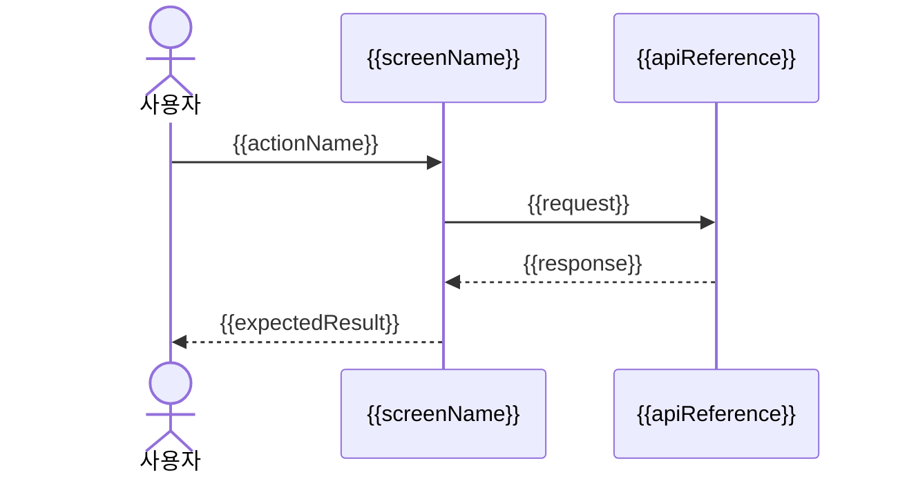

# Figma 화면정의서(Figma Screen Definition) - {{screenName}}

이 문서는 Figma 원본 화면 1개 또는 같은 화면의 상태/모달 변형 묶음을 구현 가능한 화면 기준선으로 해석한다. 이후 feature 중심 디자인/개발 화면정의서와 구분되는 Figma-first 산출물이다.

## 1. 기본 정보(Basic Information)

| 항목(Item) | 내용(Description) |
| --- | --- |
| 프로젝트(Project) | {{projectTitle}} |
| 화면명(Screen Name) | {{screenName}} |
| 대상 surface(Target Surface) | {{targetSurface}} |
| 화면 설명(Screen Description) | {{screenDescription}} |
| 경로(Route) | {{route}} |
| 인증/권한(Auth/Permission) | {{access}} |
| 레이아웃(Layout) | {{layoutReference}} |
| Primary test-id | {{primaryTestId}} |

## 2. Figma 구현 기준(Figma Implementation Baseline)

Figma는 이 문서의 visual/layout source of truth다. Figma 접근 또는 export가 불가능하면 임의 추정값을 쓰지 않고, 접근/자료 부족 사유를 명시한다.

| 항목(Item) | 내용(Description) |
| --- | --- |
| Figma 파일 URL | {{figmaFileUrl}} |
| Figma file key | {{figmaFileKey}} |
| Figma node id | {{figmaNodeId}} |
| Frame/Page name | {{figmaFrameName}} |
| Viewport/Frame size | {{figmaFrameSize}} |
| Breakpoint/Responsive 기준 | {{responsiveBaseline}} |
| 접근/Export 상태 | {{figmaAccessStatus}} |

### 2.1 Layout / Spacing

| 기준(Item) | Figma 값(Value) | 구현 메모(Implementation Note) |
| --- | --- | --- |
| Grid/Container | {{figmaGrid}} | {{figmaGridNote}} |
| Spacing/Padding | {{figmaSpacing}} | {{figmaSpacingNote}} |
| Constraints | {{figmaConstraints}} | {{figmaConstraintsNote}} |

### 2.2 Typography / Color / Asset Tokens

| 구분(Type) | Figma 값(Value) | 구현 토큰/메모(Token or Note) |
| --- | --- | --- |
| Typography | {{figmaTypography}} | {{typographyToken}} |
| Color | {{figmaColor}} | {{colorToken}} |
| Icon/Image Asset | {{figmaAsset}} | {{assetNote}} |

### 2.3 Component Mapping

| Figma component/layer | 구현 컴포넌트 | 상태/Variant | 메모 |
| --- | --- | --- | --- |
| {{figmaComponent}} | {{implementationComponent}} | {{componentVariant}} | {{componentNote}} |

## 3. 참조 계약(Referenced Contracts)

| 구분(Type) | 참조(Reference) |
| --- | --- |
| 스키마(Schema) | {{schemaReference}} |
| API | {{apiReference}} |
| 기능 정의서(Feature Definition) | {{featureReference}} |

## 4. 화면 구성(Screen Composition)

| 영역(Area) | 컴포넌트(Component) | 표시 조건(Display Rule) |
| --- | --- | --- |
| {{area}} | {{component}} | {{displayRule}} |

## 5. 화면 필드(Screen Fields)

| 필드(Field) | 타입(Type) | 필수(Required) | 검증(Validation) | 비고(Notes) |
| --- | --- | --- | --- | --- |
| {{fieldName}} | {{fieldType}} | {{required}} | {{validation}} | {{notes}} |

## 6. 화면 상태(Screen States)

| 상태(State) | 정의(Definition) | Figma node | 표시 조건(Display Rule) |
| --- | --- | --- | --- |
| Default | {{defaultState}} | {{defaultFigmaNode}} | {{defaultRule}} |
| Empty | {{emptyState}} | {{emptyFigmaNode}} | {{emptyRule}} |
| Loading | {{loadingState}} | {{loadingFigmaNode}} | {{loadingRule}} |
| Error | {{errorState}} | {{errorFigmaNode}} | {{errorRule}} |
| Permission | {{permissionState}} | {{permissionFigmaNode}} | {{permissionRule}} |

## 7. 사용자 액션(User Actions)

| 액션(Action) | test-id | 트리거(Trigger) | 동작 설명(Description) | API | 이동 화면(Target Screen) |
| --- | --- | --- | --- | --- | --- |
| {{actionName}} | {{testId}} | {{trigger}} | {{actionDescription}} | {{apiReference}} | {{targetScreen}} |

## 8. UX Flow Diagrams

### 8.1 Flowchart

```mermaid
flowchart TD
  Entry[{{route}} 진입] --> State{ {{screenState}} }
  State -->|Default| Action[{{actionName}}]
  State -->|Error| Error[{{errorState}}]
  Action --> Target[{{targetScreen}}]
```

### 8.2 Sequence Diagram



## 9. 화면 QA 인수 기준(Screen QA Acceptance Criteria)

| 검수 항목(QA Case) | 사전 조건(Precondition) | 사용자 행동(User Action) | 기대 결과(Expected Result) | 확인 데이터/상태(Data or State) | test-id | 자동화 후보(Automation Candidate) |
| --- | --- | --- | --- | --- | --- | --- |
| {{qaCaseName}} | {{precondition}} | {{userAction}} | {{expectedResult}} | {{dataOrState}} | {{testId}} | {{automationCandidate}} |

## 10. 미확정(Undecided)

| 항목(Item) | 필요한 결정(Decision Needed) | 담당(Owner) |
| --- | --- | --- |
| {{undecidedItem}} | {{decisionNeeded}} | {{owner}} |

## 11. 해당 없음(N/A)

| 항목(Item) | 사유(Reason) |
| --- | --- |
| {{naItem}} | {{naReason}} |
