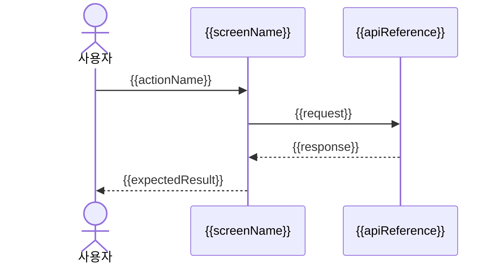

# 화면정의서(Screen Definition) - {{screenName}}

이 문서는 화면 1개를 와이어프레임(Wireframe), 프론트엔드 구현(Frontend Implementation), QA가 참조할 수 있게 정의한다.

## 1. 기본 정보(Basic Information)

| 항목(Item) | 내용(Description) |
| --- | --- |
| 프로젝트(Project) | {{projectTitle}} |
| 화면명(Screen Name) | {{screenName}} |
| 대상 surface(Target Surface) | {{targetSurface}} |
| 화면 설명(Screen Description) | {{screenDescription}} |
| 경로(Route) | {{route}} |
| 인증/권한(Auth/Permission) | {{access}} |
| 레이아웃(Layout) | {{layoutReference}} |
| Primary test-id | {{primaryTestId}} |

## 2. 참조 계약(Referenced Contracts)

| 구분(Type) | 참조(Reference) |
| --- | --- |
| 스키마(Schema) | {{schemaReference}} |
| API | {{apiReference}} |
| 기능 정의서(Feature Definition) | {{featureReference}} |

## 3. 화면 구성(Screen Composition)

| 영역(Area) | 컴포넌트(Component) | 표시 조건(Display Rule) |
| --- | --- | --- |
| {{area}} | {{component}} | {{displayRule}} |

## 4. 화면 필드(Screen Fields)

| 필드(Field) | 타입(Type) | 필수(Required) | 검증(Validation) | 비고(Notes) |
| --- | --- | --- | --- | --- |
| {{fieldName}} | {{fieldType}} | {{required}} | {{validation}} | {{notes}} |

## 5. 화면 상태(Screen States)

| 상태(State) | 정의(Definition) | 표시 조건(Display Rule) |
| --- | --- | --- |
| Default | {{defaultState}} | {{defaultRule}} |
| Empty | {{emptyState}} | {{emptyRule}} |
| Loading | {{loadingState}} | {{loadingRule}} |
| Error | {{errorState}} | {{errorRule}} |
| Permission | {{permissionState}} | {{permissionRule}} |

## 6. 사용자 액션(User Actions)

| 액션(Action) | test-id | 트리거(Trigger) | 동작 설명(Description) | API | 이동 화면(Target Screen) |
| --- | --- | --- | --- | --- | --- |
| {{actionName}} | {{testId}} | {{trigger}} | {{actionDescription}} | {{apiReference}} | {{targetScreen}} |

## 7. UX Flow Diagrams

화면 단위 UX Flow는 Flowchart와 Sequence Diagram을 필수로 남긴다. 가능한 경우 Mermaid `flowchart TD`와 `sequenceDiagram`을 사용한다. 화면 순서, 상태 전환, actor, API handoff, 오류/권한/empty 흐름이 바뀌면 두 diagram도 같은 변경에서 최신화한다.

### 7.1 Flowchart

```mermaid
flowchart TD
  Entry[{{route}} 진입] --> State{ {{screenState}} }
  State -->|Default| Action[{{actionName}}]
  State -->|Error| Error[{{errorState}}]
  Action --> Target[{{targetScreen}}]
```

### 7.2 Sequence Diagram



### 7.3 Diagram Checklist

- Flowchart가 현재 화면 진입, 상태 전환, 주요 액션, 오류/권한/empty 흐름을 반영한다.
- Sequence Diagram이 현재 사용자, 화면, API/외부 시스템 상호작용을 반영한다.
- 문서의 사용자 액션(User Actions), 화면 상태(Screen States), QA Cases와 두 diagram 사이에 오래된 단계나 이름이 남아 있지 않다.

## 8. 화면 QA 인수 기준(Screen QA Acceptance Criteria)

이 섹션은 이 화면이 구현 완료로 인정될 수 있는지 QA가 검수하는 기준이다. 제품 전체 성공 기준이 아니라, 화면 단위로 렌더링(Rendering), 권한(Permission), 입력 검증(Validation), 상태 전환(State Transition), API 연동(API Integration), 오류 처리(Error Handling)를 확인한다.

### 8.1 QA 범위(QA Scope)

| 검수 영역(QA Area) | 확인 목적(Purpose) | 필수 여부(Required) |
| --- | --- | --- |
| 화면 진입(Screen Entry) | route, 접근 권한, 초기 렌더링이 정의대로 동작하는지 확인 | Yes |
| 화면 상태(Screen States) | default/empty/loading/error/permission 상태가 구분되는지 확인 | Yes |
| 사용자 액션(User Actions) | 주요 버튼, 링크, 탭, 모달, 제출 동작이 기대 결과를 만드는지 확인 | Yes |
| 입력 검증(Input Validation) | 필수값, 형식, 길이, 중복 등 사용자가 복구 가능한 검증 메시지가 보이는지 확인 | Conditional |
| API 연동(API Integration) | 요청 시점, 성공 응답, 실패 응답, 로딩 상태가 화면에 반영되는지 확인 | Conditional |
| 이동/전환(Navigation/Transition) | 액션 이후 대상 화면, 모달, 탭, 뒤로가기 흐름이 맞는지 확인 | Conditional |
| Diagram 최신성(Diagram Freshness) | Flowchart와 Sequence Diagram이 현재 화면 상태/액션/API 흐름과 일치하는지 확인 | Yes |

### 8.2 검수 케이스(QA Cases)

| 검수 항목(QA Case) | 사전 조건(Precondition) | 사용자 행동(User Action) | 기대 결과(Expected Result) | 확인 데이터/상태(Data or State) | test-id | 자동화 후보(Automation Candidate) |
| --- | --- | --- | --- | --- | --- | --- |
| {{qaCaseName}} | {{precondition}} | {{userAction}} | {{expectedResult}} | {{dataOrState}} | {{testId}} | {{automationCandidate}} |

### 8.3 완료 판정(Pass Criteria)

- 화면정의서의 주요 사용자 액션(User Actions)이 모두 검수 케이스(QA Cases)에 연결되어 있다.
- 권한이 필요한 화면은 허용/차단 케이스가 모두 있다.
- API를 사용하는 화면은 성공/실패/로딩 상태가 모두 확인 가능하다.
- 입력 폼이 있는 화면은 필수값과 오류 메시지 기준이 있다.
- 와이어프레임(Wireframe)과 구현 UI가 이 화면의 기대 결과(Expected Result)를 벗어나지 않는다.
- Flowchart와 Sequence Diagram이 존재하고 현재 UX Flow와 일치한다.

## 9. 미확정(Undecided)

| 항목(Item) | 필요한 결정(Decision Needed) | 담당(Owner) |
| --- | --- | --- |
| {{undecidedItem}} | {{decisionNeeded}} | {{owner}} |

## 10. 해당 없음(N/A)

| 항목(Item) | 사유(Reason) |
| --- | --- |
| {{naItem}} | {{naReason}} |
