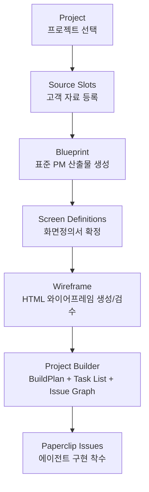

# Builder

BBR 전용 Paperclip 플러그인. 고객이 제공한 프로젝트 자료를 Paperclip 프로젝트(Project)에 등록하고, PM 에이전트(PM Agent)가 회사 표준 산출물을 만든 뒤, 와이어프레임(Wireframe)과 구현 이슈 그래프(Issue Graph)까지 이어지게 하는 통합 Builder 플러그인이다.

기존 분리 플러그인인 `cos-blueprint`, `wireframe-builder`, `product-builder`는 이 패키지 하나로 통합되었다. 운영 기준 설치 대상은 `bbr-plugins/builder` 하나다.

## 목적(Goal)

Builder의 목적은 단순 문서 생성이 아니라 프로젝트 실행 준비 상태를 만드는 것이다.

1. 고객 자료를 프로젝트(Project)의 source slot에 등록한다.
2. 표준 기획서(Standard Plan), PRD(Product Requirements Document), 기능 정의서(Feature Definition), 스키마/API/인터페이스/레이아웃/화면정의서를 고정 산출물로 만든다.
3. 화면정의서(Screen Definitions)를 기준으로 클릭 가능한 HTML 와이어프레임(HTML Wireframe)을 만든다.
4. Blueprint/Wireframe 산출물을 읽어 BuildPlan, 전체 Task 목록(Full Task List), Paperclip 이슈 그래프(Issue Graph)를 만든다.
5. 여러 프로젝트를 동시에 진행할 수 있게 프로젝트별 상태와 산출물을 분리한다.

## 메뉴(Menu)

Paperclip 좌측 메뉴에는 `Builder` 섹션 아래에 다음 순서로 노출된다.

1. Blueprint
2. Wireframe
3. Project Builder

각 메뉴는 독립적으로 열 수 있지만, 표준 진행은 `Blueprint -> Wireframe -> Project Builder` 순서다.

## 전체 흐름(Workflow)



## 1. Blueprint

Blueprint는 실제 PM 업무 순서대로 프로젝트 자료를 분석하고 회사 표준 산출물을 만든다.

### 입력(Input)

- 직접 입력 텍스트(Text)
- URL, 예: Notion 공유 URL
- 파일(File): `.txt`, `.md`, `.docx`, `.pptx`, `.pdf`, `.xlsx`
- 여러 개의 고객 문서(Customer Documents). 10개 이상도 source slot collection으로 누적 등록 가능

### 제품 유형(Product Type)

제품 유형은 Project Builder가 아니라 Blueprint에서 선택한다. 기획 단계에서 제품 성격을 확정하는 것이 더 명확하기 때문이다.

| 값(Value) | 의미(Meaning) |
| --- | --- |
| 웹서비스(Web Service) | 공개 웹사이트, SEO/AEO/GEO, 관리자, REST API, 서비스 백엔드 중심 |
| 웹 어플리케이션(Web Application) | 로그인 후 반복 작업 중심 SPA, REST API 서버, 관리자, AI 서버 중심 |

### 주요 액션(Actions)

| 액션(Action) | 역할(Role) |
| --- | --- |
| `register-source-document` | source slot에 고객 자료 등록 |
| `set-product-builder-blueprint` | 제품 유형 선택 |
| `run-standard-plan` | 표준 기획서/PRD/기능/계약 산출물 초안 생성 |
| `confirm-standard-plan` | 표준 기획서 확정 |
| `write-standard-plan-docs` | 표준 산출물을 Project deliverable slot에 기록 |
| `run-screens` | 화면정의서 생성 |
| `write-screen-docs` | 화면정의서를 Project deliverable slot에 기록 |
| `review-screen` | 화면별 검수 상태/코멘트 기록 |
| `regenerate-screen` | 특정 화면정의서 재생성 |
| `reconcile-managed-agent` | Blueprint 전용 PM/계약/화면 에이전트 정합성 보정 |
| `reconcile-managed-resources` | Blueprint 전용 project/skill/routine 리소스 정합성 보정 |
| `run-managed-routine` | Blueprint 관리형 routine 실행 |
| `read-source-original` | legacy 원본 바이너리 다운로드 호환 |
| `reset` | 현재 프로젝트 Blueprint 상태 초기화 |

### Blueprint 산출물(Output)

Blueprint 산출물은 workspace export 경로가 아니라 Project document slot이 기준이다.

| Slot | 산출물(Deliverable) | 템플릿(Template) |
| --- | --- | --- |
| `support.pm_execution_procedure` | PM 업무 실행 절차(PM Execution Procedure) | `templates/standards/pm-execution-procedure.md` |
| `support.screen_definition_writing_rules` | 화면정의서 작성 룰(Screen Definition Writing Rules) | `templates/standards/screen-definition-writing-rules.md` |
| `deliverable.standard_plan` | 표준 기획서(Standard Plan) | `templates/deliverables/standard-plan.md` |
| `deliverable.prd` | PRD(Product Requirements Document) | `templates/deliverables/prd.md` |
| `deliverable.feature_index` | 기능 정의서 목록(Feature Definition Index) | `templates/deliverables/feature-definition-index.md` |
| `deliverable.feature_files` | 기능별 기능 정의서(Feature Definitions) | `templates/deliverables/feature-definition.md` |
| `deliverable.schema_definition` | 스키마 정의서(Schema Definition) | `templates/deliverables/schema-definition.md` |
| `deliverable.api_definition` | API 정의서(API Definition) | `templates/deliverables/api-definition.md` |
| `deliverable.interface_definition` | 인터페이스 정의서(Interface Definition) | `templates/deliverables/interface-definition.md` |
| `deliverable.layout_definition` | 공통 레이아웃 정의서(Common Layout Definition) | `templates/deliverables/layout-definition.md` |
| `deliverable.screen_definitions` | 화면정의서(Screen Definitions) | `templates/deliverables/screen-definition.md` |

### 작성 기준(Writing Rules)

- 표준 기획서(Standard Plan)는 후속 산출물 생성을 위한 실행 기준선이다.
- PRD(Product Requirements Document)는 사용자 문제, 대상 사용자, 성공 기준, 제품 요구사항을 다룬다.
- 기능 요구사항은 기능 정의서 목록과 기능별 기능 정의서로 분리한다.
- PM 산출물에는 기능 코드(Feature Code)를 넣지 않는다. 기능명(Feature Name)과 Project slot 문서 참조(Project Slot Document Reference)로 추적한다.
- 내용이 없는 산출물은 삭제하지 않는다. `해당 없음(N/A)`과 사유를 남긴다.
- 자료가 부족하면 추론으로 채우지 않고 Missing Inputs 또는 미확정 항목으로 남긴다.

## 2. Wireframe

Wireframe은 Blueprint가 만든 화면정의서(Screen Definitions)를 읽어 단일 HTML 와이어프레임을 만든다.

### 입력(Input)

- `deliverable.screen_definitions`
- 준비되어 있으면 `deliverable.standard_plan`
- 필요 시 참고 문서(Reference Docs)

### 주요 액션(Actions)

| 액션(Action) | 역할(Role) |
| --- | --- |
| `createWireframe` | 프로젝트별 wireframe record 생성 |
| `triggerGenerate` | HTML 생성 시작 |
| `addComment` | 검수 코멘트와 HTML 수정 요청 |
| `updateInputs` | 입력 문서/화면 모델 수정 |
| `deleteWireframe` | wireframe record 삭제 |
| `extractScreenModel` | 자유 형식 화면정의서에서 8섹션 JSON 모델 추출 |

### 산출물(Output)

| Slot | 산출물(Deliverable) | 저장 형태(Storage) |
| --- | --- | --- |
| `deliverable.wireframe_html` | HTML 와이어프레임(HTML Wireframe) | Project document/artifact slot |

Wireframe route sidebar도 선택된 `projectId` 기준으로 현재 wireframe을 조회한다. 프로젝트 context가 없을 때만 company-wide fallback을 사용한다.

## 3. Project Builder

Project Builder는 Blueprint와 Wireframe 산출물을 읽어 실제 구현에 필요한 Paperclip 이슈 그래프를 만든다.

### 필수 입력(Required Inputs)

Project Builder는 파일 경로나 workspace export를 추측하지 않고 Project deliverable slot만 읽는다.

| Slot | 입력(Input) |
| --- | --- |
| `deliverable.standard_plan` | 표준 기획서(Standard Plan) |
| `deliverable.prd` | PRD(Product Requirements Document) |
| `deliverable.feature_files` | 기능별 기능 정의서(Feature Definitions) |
| `deliverable.schema_definition` | 스키마 정의서(Schema Definition) |
| `deliverable.api_definition` | API 정의서(API Definition) |
| `deliverable.interface_definition` | 인터페이스 정의서(Interface Definition) |
| `deliverable.layout_definition` | 공통 레이아웃 정의서(Common Layout Definition) |
| `deliverable.screen_definitions` | 화면정의서(Screen Definitions) |
| `deliverable.wireframe_html` | HTML 와이어프레임(HTML Wireframe) |

### 산출물(Output)

| Slot | 산출물(Deliverable) | 저장 형태(Storage) |
| --- | --- | --- |
| `deliverable.build_plan` | BuildPlan | Project document slot |
| `deliverable.task_list` | 전체 Task 목록(Full Task List) | Project document slot |
| `deliverable.issue_graph` | Paperclip 이슈 그래프(Issue Graph) | Project document slot + Paperclip issues |

### 빌드 방식(Build Mode)

- Classic build: 선택된 제품 유형(Product Type)과 Blueprint 산출물을 기준으로 표준 task set을 생성한다.
- Workflow build: agent/tool이 전달한 구조화 BuildPlan을 기준으로 feature별 5단계 BE -> BE QA -> FE -> FE QA -> 전체 QA 흐름을 만든다.
- Product Builder는 기획을 다시 쓰지 않는다. 앞 단계 산출물을 구현 이슈로 전환한다.

### 주요 액션(Actions)

| 액션(Action) | 역할(Role) |
| --- | --- |
| `instantiate-build` | Classic build를 실행해 BuildPlan, Task List, Issue Graph를 생성 |
| `instantiate-build-plan` | 구조화 BuildPlan 기반 Workflow build를 실행 |

## Project document slot 기준

이 플러그인의 완료 기준은 로컬 파일 경로가 아니라 Paperclip Project document slot이다.

### Source slots

| Slot | 의미(Meaning) |
| --- | --- |
| `source.customer_originals` | 고객 원본(Customer Originals) |
| `source.internal_notes` | 내부 정리본(Internal Notes) |
| `source.references` | 참고 자료(References) |

### Slot 상태(Status)

| 상태(Status) | 의미(Meaning) |
| --- | --- |
| `empty` | slot은 있으나 아직 내용 없음 |
| `draft` | 초안 있음 |
| `ready` | 다음 단계가 읽을 수 있음 |
| `approved` | 운영자/PM이 확정함 |
| `n/a` | 해당 없음. 본문에 사유 필요 |

## 동시 프로젝트 실행(Concurrent Projects)

여러 프로젝트를 동시에 진행할 수 있게 상태를 프로젝트 단위로 분리했다.

### Blueprint

- `jobId`, `stage`, `projectId`를 job 상태에 기록한다.
- Project A와 Project B의 `run-standard-plan`, `run-screens`, `regenerate-screen`은 동시에 실행 가능하다.
- 같은 프로젝트에서 이미 running job이 있으면 중복 실행을 시작하지 않고 기존 job 상태를 반환한다.
- reset/re-run 이후 이전 background job이 늦게 끝나도 `jobId`가 다르면 현재 상태를 덮어쓰지 않는다.

### Wireframe

- `wireframe.getCurrent`는 `projectId`가 있으면 해당 프로젝트의 최신 wireframe만 반환한다.
- 같은 프로젝트의 wireframe이 `generating`이면 새 생성/삭제를 막는다.
- 다른 프로젝트의 wireframe 생성/검수는 독립적으로 진행된다.
- 프로젝트 context가 없을 때만 company-wide fallback을 사용한다.

### Project Builder

- `last-build`는 company scope가 아니라 project scope에 저장한다.
- `buildJob`도 project scope에 저장한다.
- 같은 프로젝트에서 build가 running이면 중복 build를 막는다.
- 다른 프로젝트의 build는 동시에 실행할 수 있다.

현재 lock은 일반적인 단일 plugin worker 프로세스 기준이다. 나중에 같은 plugin worker를 여러 서버/프로세스로 수평 확장하면 `ctx.state`의 CAS 또는 DB 기반 distributed lock을 추가해야 한다.

## UI 기준(UI)

- Builder 메뉴 아래 3개 페이지를 순차적으로 배치한다.
- Blueprint에서 제품 유형(Product Type)과 URL/file source를 받는다.
- Wireframe sidebar는 선택된 Project context를 유지한다.
- UI는 가능한 한 플러그인 공통 primitive와 shadcn 스타일 컴포넌트를 사용한다. HTML 기본 `input`, `select`를 직접 쓰는 대신 일관된 컴포넌트 표면을 우선한다.

## 템플릿(Templates)

모든 표준 템플릿은 이 패키지 내부에 있다.

```text
bbr-plugins/builder/templates/
  deliverables/
    standard-plan.md
    prd.md
    feature-definition-index.md
    feature-definition.md
    schema-definition.md
    api-definition.md
    interface-definition.md
    layout-definition.md
    screen-definition.md
  standards/
    pm-execution-procedure.md
    screen-definition-writing-rules.md
  wireframe/
    wireframe-html-prompt.md
  project-builder/
    build-plan.md
    task-list.md
```

## 설치(Install)

```sh
cd bbr-plugins/builder
pnpm install
pnpm build
paperclipai plugin install /absolute/path/to/company-os-v2/bbr-plugins/builder
```

운영 기준에서는 기존 분리 패키지인 `cos-blueprint`, `wireframe-builder`, `product-builder`와 동시에 설치하지 않는다. 마이그레이션 중 동시에 설치된 경우 호스트 UI가 동일 route/sidebar를 Builder 기준으로 우선 표시하지만, 최종 설치 대상은 Builder 하나다.

## 검증(Verification)

```sh
cd bbr-plugins/builder
pnpm typecheck
pnpm test
pnpm build
```

현재 주요 회귀 테스트는 다음을 검증한다.

- Blueprint, Wireframe, Project Builder가 단일 worker/manifest로 묶이는지
- source 문서 업로드와 중복 업로드 처리
- 10개 이상 source 문서 누적 등록
- Blueprint 상태와 산출물 slot이 project-scoped인지
- legacy company state가 source slot과 매칭되는 project에만 승계되는지
- Blueprint 동시 A/B 프로젝트 job과 stale reset 방지
- Wireframe project scoping과 generating 상태 보호
- Project Builder project-scoped `lastBuild`와 중복 build guard
