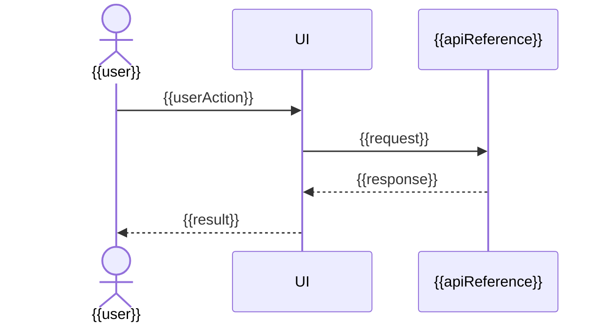

# 기능 정의서(Feature Definition) - {{featureName}}

이 문서는 기능 1개를 실제 구현/검증 가능한 단위로 정리한 문서다. 기능 코드는 사용하지 않는다.

## 1. 요약(Summary)

| 항목(Item) | 내용(Description) |
| --- | --- |
| 프로젝트(Project) | {{projectTitle}} |
| 기능(Feature) | {{featureName}} |
| 우선순위(Priority) | {{priority}} |
| 목적(Purpose) | {{purpose}} |
| 상세 문서 참조(Document Reference) | {{documentRef}} |

## 2. project-builder-base 재사용 계획(Project Builder Base Reuse Plan)

프로젝트 구조 세팅은 project-builder-base를 hard-copy해서 시작한다. 이 기능은 admin/site/app/landing 등 대상 surface와 기존 feature 재사용 범위를 먼저 판정한 뒤 구현한다.

| 항목(Item) | 내용(Description) |
| --- | --- |
| 대상 surface(Target Surface) | {{targetSurface}} |
| 재사용 판정(Reuse Decision) | {{reuseDecision}} |
| 재사용 후보(Base Feature Reference) | {{baseFeatureReference}} |
| hard-copy 범위(Hard-copy Scope) | {{hardCopyScope}} |
| 커스터마이징 범위(Customization Scope) | {{customizationScope}} |
| 신규 구현 사유(New Build Reason) | {{newBuildReason}} |

## 3. 사용자와 조건(User & Conditions)

| 항목(Item) | 내용(Description) |
| --- | --- |
| 사용자(User) | {{user}} |
| 진입 조건(Preconditions) | {{preconditions}} |
| 완료 조건(Done Condition) | {{doneCondition}} |

## 4. 주요 흐름(Main Flow)

1. {{mainFlowStep}}

## 5. Flowchart

기능 단위 흐름은 Flowchart를 필수로 남긴다. 가능한 경우 Mermaid `flowchart TD` 형식을 사용한다. 기능 범위, 분기, 상태, 예외 처리가 바뀌면 이 diagram도 같은 변경에서 최신화한다.

```mermaid
flowchart TD
  Start([Start]) --> Step1[{{mainFlowStep}}]
  Step1 --> Decision{ {{decisionPoint}} }
  Decision -->|Yes| Success([Done])
  Decision -->|No| Exception[{{exceptionHandling}}]
```

## 6. Sequence Diagram

기능 단위 actor/system/API 상호작용은 Sequence Diagram을 필수로 남긴다. 가능한 경우 Mermaid `sequenceDiagram` 형식을 사용한다. actor, API, 이벤트, 저장소, 외부 시스템, 오류 응답이 바뀌면 이 diagram도 같은 변경에서 최신화한다.



## 7. 예외 흐름(Exception Flow)

| 상황(Case) | 처리(Handling) |
| --- | --- |
| {{exceptionCase}} | {{exceptionHandling}} |

## 8. 입력/출력(Input/Output)

| 구분(Type) | 내용(Description) |
| --- | --- |
| 입력(Input) | {{input}} |
| 출력(Output) | {{output}} |

## 9. 참조 산출물(References)

| 산출물(Output) | 참조 방식(Reference Rule) |
| --- | --- |
| project-builder-base | {{baseFeatureReference}} |
| 스키마 정의서(Schema Definition) | {{schemaReference}} |
| REST API 정의서(REST API Definition) | {{apiReference}} |
| 화면정의서(Screen Definition) | {{screenReference}} |

## 10. 인수 기준(Acceptance Criteria)

- {{acceptanceCriteria}}
- project-builder-base 기준 재사용 판정과 대상 surface가 명시된다.
- Flowchart가 현재 기능 범위, 주요 분기, 예외 흐름을 반영한다.
- Sequence Diagram이 현재 actor, UI/API/저장소/외부 시스템 상호작용을 반영한다.
- 기능 범위나 흐름이 변경되면 Flowchart와 Sequence Diagram도 함께 갱신된다.

## 11. 제외 범위(Out of Scope)

- {{outOfScopeItem}}

## 12. 해당 없음(N/A)

| 항목(Item) | 사유(Reason) |
| --- | --- |
| {{naItem}} | {{naReason}} |
