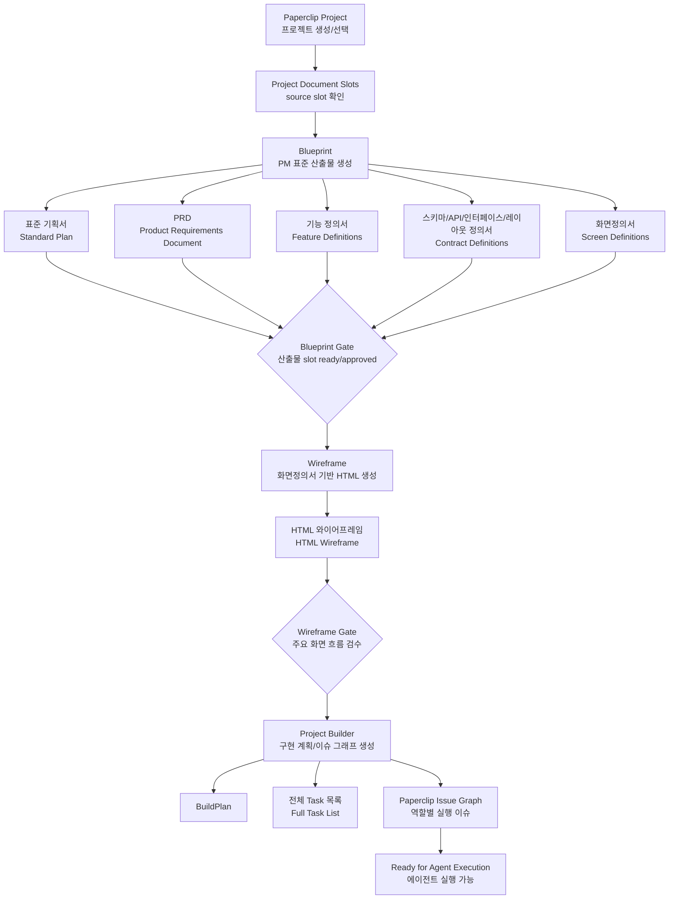

# Mission Progress Plugin Workflow (완전판)

Date: 2026-06-22
Status: Draft for review
Scope: BBR execution workflow on Paperclip

## 1. 목표(Goal)

최종 목표는 고객이 제공한 프로젝트 자료를 Paperclip의 프로젝트(Project)에 등록하고, 3개 플러그인이 순차적으로 고정 산출물(Fixed Deliverables)을 만들며, 마지막에는 에이전트가 실제 구현을 시작할 수 있는 Paperclip 이슈 그래프(Issue Graph)까지 생성하는 것이다.

핵심 플러그인(Core Plugins)은 3개다.

1. 블루프린트(Blueprint)
2. 와이어프레임(Wireframe)
3. 프로젝트 빌더(Project Builder)

여기서 미션(Mission)은 Paperclip 프로젝트(Project)를 중심으로 관리한다. 운영상 미션은 프로젝트(Project), 프로젝트 문서 슬롯(Project Document Slots), 산출물(Deliverables), 구현 이슈 그래프(Issue Graph)의 조합이다.

## 2. 운영 원칙(Operating Principles)

- 산출물(Output)은 고정이다. 프로젝트마다 "어떤 산출물을 만들지" 선택하지 않는다.
- 내용이 없는 산출물은 삭제하지 않고 `해당 없음(N/A)`으로 남긴다. 에이전트가 빈 내용을 추론으로 채우면 안 된다.
- 입력 자료는 Paperclip 프로젝트(Project)에 등록된 문서(Document)에서 찾고 별도 목록 문서로 중복 관리하지 않는다.
- 단계 완료 판단은 문서 슬롯(Document Slot), workspace 파일, work product, issue graph 같은 검토 가능한 결과로 한다.
- 실행 절차(Execution Procedure)와 작성 룰(Writing Rules)은 프로젝트마다 바뀌지 않는 고정 기준으로 분리한다.
- 기능 요구사항(Functional Requirements)은 기능 정의서 목록(Feature Definition Index)과 기능별 기능 정의서(Feature Definition)로 분리한다.
- 기능 정의서에는 기능 코드(Feature Code)를 넣지 않는다. PM 산출물은 기능명(Feature Name)과 문서 경로(Document Path)로 추적한다.
- 스키마(Schema), API, 인터페이스(Interface), 화면(Screen)은 개발과 QA가 사용할 수 있는 계약(Contract)으로 쓴다.
- Product Builder의 내부 task key, feature slug, issue id는 시스템 식별자(System Identifier)로만 본다. PM 산출물에는 노출하지 않는다.

## 3. 정리된 운영 범위(Pruned Operating Scope)

아래 요소는 현재 workflow에서 운영 단위로 두지 않는다. 목적은 산출물 생성과 구현 task 전환에 직접 필요한 흐름만 남기는 것이다.

| 제외 요소(Excluded Element) | 이유(Reason) | 처리(Handling) |
| --- | --- | --- |
| 프로젝트별 산출물 선택 | 산출물은 프로젝트마다 선택하지 않고 고정되어야 함 | 모든 산출물 슬롯을 항상 만든다. |
| 별도 입력 목록 문서 | Project에 등록된 source slot과 중복됨 | Project 문서 슬롯에서 입력 자료를 찾는다. |
| 단계별 로그 문서 | 산출물 품질과 직접 무관하고 운영 노이즈가 큼 | 완료 증거는 산출물/slot/issue graph로 판단한다. |
| 별도 미션 저장 모델 | Paperclip Project가 실행 단위가 될 수 있음 | Project 확장으로 해결한다. |
| 검색/등재 보조 흐름 | 핵심 산출물 생성과 구현 task 생성에 직접 필요 없음 | 필수 게이트에 넣지 않는다. |

## 4. 프로젝트 문서 슬롯(Project Document Slots)

Paperclip 프로젝트(Project)에 문서 슬롯(Document Slot)을 추가해서 입력 자료와 산출물을 모두 같은 표면에서 관리한다.

핵심 규칙:

1. 고객 원본(Customer Originals), 내부 정리본(Internal Notes), 참고 자료(References)는 Project의 source slot에 등록한다.
2. Blueprint는 source slot을 읽어서 고정 산출물 deliverable slot을 채운다.
3. Wireframe은 화면정의서(Screen Definition) slot을 읽고 HTML 와이어프레임(HTML Wireframe) slot을 채운다.
4. Project Builder는 Blueprint/Wireframe deliverable slot을 읽고 BuildPlan, Task 목록, Issue Graph를 만든다.
5. 산출물 slot은 항상 존재한다. 내용이 없으면 slot 상태를 `n/a`로 두고 이유를 본문에 적는다.

### 4.1 Source Slots

| 슬롯 키(Slot Key) | 이름(Name) | 필수(Required) | 설명(Description) |
| --- | --- | --- | --- |
| `source.customer_originals` | 고객 원본(Customer Originals) | 권장 | 고객이 제공한 원문, 회의록, 제안서, 스토리보드, URL 캡처 |
| `source.internal_notes` | 내부 정리본(Internal Notes) | 권장 | PM이 고객 자료를 정리한 md/txt/docx/pptx 추출문 |
| `source.references` | 참고 자료(References) | 선택 | 경쟁사, 레퍼런스, 정책, 외부 링크에서 추출한 자료 |

### 4.2 Deliverable Slots

아래 deliverable slot은 고정이다.

| 슬롯 키(Slot Key) | 산출물(Deliverable) | 기본 경로(Default Path) | 생성 플러그인(Producer) |
| --- | --- | --- | --- |
| `deliverable.standard_plan` | 표준 기획서(Standard Plan) | `docs/cos-blueprint/standard-plan.md` | Blueprint |
| `deliverable.prd` | PRD(Product Requirements Document) | `docs/cos-blueprint/product-requirements-document.md` | Blueprint |
| `deliverable.feature_index` | 기능 정의서 목록(Feature Definition Index) | `docs/cos-blueprint/feature-definition.md` | Blueprint |
| `deliverable.feature_files` | 기능별 기능 정의서(Feature Definitions) | `docs/cos-blueprint/features/{feature-name}.md` | Blueprint |
| `deliverable.schema_definition` | 스키마 정의서(Schema Definition) | `docs/cos-blueprint/schema-definition.md` | Blueprint |
| `deliverable.api_definition` | API 정의서(API Definition) | `docs/cos-blueprint/api-definition.md` | Blueprint |
| `deliverable.interface_definition` | 인터페이스 정의서(Interface Definition) | `docs/cos-blueprint/interface-definition.md` | Blueprint |
| `deliverable.layout_definition` | 공통 레이아웃 정의서(Common Layout Definition) | `docs/cos-blueprint/layout-definition.md` | Blueprint |
| `deliverable.screen_definitions` | 화면정의서(Screen Definitions) | `docs/cos-blueprint/screens/{screen-name}.md` | Blueprint |
| `deliverable.wireframe_html` | HTML 와이어프레임(HTML Wireframe) | `docs/wireframes/{wireframe-name}.html` | Wireframe |
| `deliverable.build_plan` | BuildPlan | `docs/product-builder/build-plan.md` | Project Builder |
| `deliverable.task_list` | 전체 Task 목록(Full Task List) | `docs/product-builder/task-list.md` | Project Builder |
| `deliverable.issue_graph` | Paperclip 이슈 그래프(Issue Graph) | Paperclip issues | Project Builder |

### 4.3 Slot Status

| 상태(Status) | 의미(Meaning) |
| --- | --- |
| `empty` | slot은 있으나 내용이 아직 없음 |
| `draft` | 에이전트가 초안을 생성함 |
| `ready` | 다음 단계 입력으로 사용할 수 있음 |
| `approved` | 운영자 또는 PM Agent가 확정함 |
| `n/a` | 이 프로젝트에는 해당 내용이 없음. 본문에 이유가 있어야 함 |

## 5. Project 확장 스키마(Project Extension Schema)

현재 Paperclip core에는 전역 문서(Document)와 이슈 문서(Issue Document)는 있지만, Project에 고정 산출물을 직접 매핑하는 slot은 별도로 보이지 않는다. 따라서 완전판에서는 Project 기능에 아래 개념을 추가한다.

### 5.1 테이블(Table): `project_document_slots`

| 필드(Field) | 타입(Type) | 설명(Description) |
| --- | --- | --- |
| `id` | uuid | slot id |
| `company_id` | uuid | 회사(Company) 경계 |
| `project_id` | uuid | 대상 프로젝트(Project) |
| `slot_key` | text | 예: `deliverable.prd` |
| `slot_group` | text | `source`, `deliverable`, `support` |
| `title` | text | 사람이 보는 이름 |
| `required` | boolean | 고정 slot 여부 |
| `status` | text | `empty`, `draft`, `ready`, `approved`, `n/a` |
| `document_id` | uuid nullable | markdown/text 문서일 때 `documents.id` 참조 |
| `artifact_id` | uuid nullable | HTML, 첨부 파일, work product 참조가 필요할 때 사용 |
| `workspace_path` | text nullable | workspace에 export된 파일 경로 |
| `content_type` | text nullable | `text/markdown`, `text/html`, `application/pdf` 등 |
| `metadata` | jsonb nullable | 원본 파일명, URL, version, producer plugin, generatedAt 등 |
| `created_at` | timestamptz | 생성 시각 |
| `updated_at` | timestamptz | 수정 시각 |

필수 제약(Invariants):

- `(company_id, project_id, slot_key)`는 unique여야 한다.
- `project_id`가 가리키는 Project와 `company_id`는 항상 같아야 한다.
- `document_id`가 있으면 Document도 같은 company에 속해야 한다.
- `required = true`인 deliverable slot은 삭제하지 않는다. 내용이 없으면 `status = n/a` 또는 `empty`로 둔다.

### 5.2 REST API

Base path는 Paperclip 기준에 맞춰 `/api` 아래에 둔다.

| Method | Path | 목적(Purpose) |
| --- | --- | --- |
| `GET` | `/api/projects/:projectId/document-slots` | 프로젝트의 모든 source/deliverable slot 조회 |
| `GET` | `/api/projects/:projectId/document-slots/:slotKey` | 특정 slot 조회 |
| `PUT` | `/api/projects/:projectId/document-slots/:slotKey` | slot 생성/갱신, document 연결, 상태 변경 |
| `POST` | `/api/projects/:projectId/document-slots/:slotKey/import` | 업로드 파일, URL 추출문, 기존 document를 slot에 등록 |
| `POST` | `/api/projects/:projectId/document-slots/:slotKey/export-workspace` | slot 내용을 workspace 경로로 export |
| `GET` | `/api/projects/:projectId/document-slots/:slotKey/content` | slot의 최신 본문 또는 artifact 링크 조회 |

권한(Authz) 기준:

- 모든 API는 company access check를 통과해야 한다.
- board operator는 source/deliverable slot을 모두 수정할 수 있다.
- agent는 자신에게 허용된 project 범위 안에서만 slot을 읽고, 담당 플러그인이 생성하는 slot만 쓸 수 있어야 한다.
- mutation은 activity log를 남겨야 한다.

## 6. 전체 흐름(End-to-End Flow)



### 단계 경계(Stage Boundary)

| 단계(Stage) | 시작 조건(Entry Condition) | 종료 증거(Exit Evidence) |
| --- | --- | --- |
| 프로젝트 준비(Project Setup) | 대상 회사(Company)와 프로젝트(Project)가 있음 | source/deliverable slot이 생성됨 |
| 블루프린트(Blueprint) | Project source slot에 분석 가능한 문서가 있음 | Blueprint deliverable slot이 `ready` 또는 `approved` |
| 와이어프레임(Wireframe) | 화면정의서(Screen Definitions)가 `ready` 또는 `approved` | HTML 와이어프레임 slot이 `ready` |
| 프로젝트 빌더(Project Builder) | Blueprint/Wireframe 산출물 slot이 준비됨 | BuildPlan, Task 목록, Issue Graph 생성 |
| 실행 준비(Ready for Execution) | Issue Graph가 생성됨 | repo/workspace/branch/env/assignee/blocker 확인 |

## 7. 산출물 생성 절차 매트릭스(Procedure to Result Matrix)

| 순서(Order) | 절차(Procedure) | 실행 단위(Action/Unit) | 결과(Result) | 완료 증거(Completion Evidence) | 다음 입력(Next Input) |
| --- | --- | --- | --- | --- | --- |
| 0 | 프로젝트 범위 고정(Project Scope Freeze) | `M0` | 회사, 프로젝트, 목표, 제외 범위 | Project가 선택됨 | 문서 slot 준비 |
| 1 | Project 문서 slot 준비(Document Slot Setup) | `M1` | source/deliverable slot | slot 목록 존재 | Blueprint 입력 |
| 2 | 입력 문서 확인(Source Document Check) | `M2` | 분석 가능/부족/n/a 판단 | source slot status | Blueprint 리소스 준비 |
| 3 | Blueprint 리소스 준비(Resource Preparation) | `reconcile-managed-resources` | Blueprint agents/project/skills/routines | managed resource 확인 | 산출물 생성 |
| 4 | Project 문서 입력 동기화(Project Source Sync) | `register-source-document` 또는 Project slot import | Blueprint source context | source slot/document 연결 | 표준 기획 생성 |
| 5 | 표준 기획서/PRD 초안 생성(Standard Plan and PRD Draft) | `run-standard-plan` | StandardPlan draft | job 완료 + draft 존재 | 표준 문서 기록 |
| 6 | 표준 산출물 문서 기록(Standard Document Write) | `write-standard-plan-docs` | 표준 기획서, PRD, 기능/계약 문서 | deliverable slot + workspace file | PM 검토 |
| 7 | PM 검토와 확정(PM Review and Confirmation) | `confirm-standard-plan` | 확정된 StandardPlan | `confirmedAt` 또는 slot approved | 화면정의서 생성 |
| 8 | 화면정의서 생성(Screen Definition Generation) | `run-screens` | ScreenPlan | 화면 목록 존재 | 화면정의서 기록 |
| 9 | 화면정의서 문서 기록(Screen Document Write) | `write-screen-docs` | 화면별 md | screen slot + workspace file | 화면별 검토 |
| 10 | 화면별 리뷰/재생성(Screen Review and Regeneration) | `review-screen`, `regenerate-screen` | 승인된 화면정의서 | 화면별 approved/changes requested | Wireframe 입력 |
| 11 | Wireframe 입력 구성(Input Assembly) | `W0` | 화면정의서 기반 입력 | screen slot read | wireframe record |
| 12 | 와이어프레임 레코드 생성(Wireframe Record Creation) | `createWireframe` | draft wireframe record | plugin DB record | HTML 생성 |
| 13 | HTML 생성(HTML Generation) | `triggerGenerate` | 클릭 가능한 HTML | status `generated` + HTML 존재 | 화면 흐름 검수 |
| 14 | 화면 흐름 검수/수정(Screen Flow QA and Revision) | `addComment` | 수정된 HTML | 주요 흐름 검수 통과 | HTML slot 기록 |
| 15 | 와이어프레임 고정(Wireframe Freeze) | `W5` | HTML 와이어프레임 | `deliverable.wireframe_html` ready | Product Builder 입력 |
| 16 | 구현 입력 확인(Build Input Check) | `P0` | BuildPlan 작성 가능 판단 | 필수 slot 확인 | base capability 검증 |
| 17 | 기준 코드베이스 확인(Base Capability Verification) | `P1` | `product-builder-base` repo/path/ref | capability 출처 증거 | 기능별 판정 |
| 18 | 기능 목록 정규화와 stage 판정(Feature Normalization and Stage Decision) | `P2-P4` | feature/shared/stage decision | REUSE/EXTEND/NEW/N/A 판정 | BuildPlan 작성 |
| 19 | BuildPlan 작성(BuildPlan Composition) | `P5` | 구조화 BuildPlan | build-plan slot draft/ready | 이슈 그래프 생성 |
| 20 | 이슈 그래프 생성(Issue Graph Instantiation) | `instantiate-build-plan` | root/feature/stage/integration/release issues | Paperclip issue graph | 이슈 그래프 검수 |
| 21 | 실행 준비 고정(Execution Readiness Freeze) | `P7-P8` | Ready for Agent Execution | repo/workspace/branch/env/assignee/blocker 확인 | 구현 실행 |

## 8. 미션 준비 하위절차(Mission Setup Sub-steps)

### M0. 프로젝트 범위 고정(Project Scope Freeze)

| 항목(Item) | 내용(Detail) |
| --- | --- |
| 담당(Owner) | 운영자(Operator), PM Agent |
| 입력(Input) | 고객 요청, 내부 메모, 계약 전 자료, 회의록 |
| 결과(Output) | 대상 회사(Company), 대상 프로젝트(Project), 목표(Goal), 제외 범위(Out of Scope) |
| 확인(Check) | "무엇을 만들 것인가"가 한 문장으로 설명됨 |

하위절차(Sub-steps):

1. 대상 회사(Company)와 프로젝트(Project)를 선택한다.
2. 프로젝트 목표(Project Goal)를 한 문장으로 고정한다.
3. 제외 범위(Out of Scope)를 짧게 적는다.
4. 산출물은 고정 목록 전체를 대상으로 한다. 필요한 산출물을 선택하지 않는다.

### M1. Project 문서 slot 준비(Document Slot Setup)

| 항목(Item) | 내용(Detail) |
| --- | --- |
| 담당(Owner) | 운영자(Operator), PM Agent |
| 결과(Output) | source slot과 deliverable slot |
| 확인(Check) | 고정 slot 목록이 Project에 생성되어 있음 |

하위절차(Sub-steps):

1. source slot 3종을 만든다: 고객 원본, 내부 정리본, 참고 자료.
2. deliverable slot 전체를 만든다.
3. 이미 생성된 slot은 재사용하고, 누락된 slot만 생성한다.
4. deliverable slot은 required로 둔다.
5. 내용이 없는 산출물은 삭제하지 않고 `n/a`로 표시한다.

### M2. 입력 문서 확인(Source Document Check)

| 항목(Item) | 내용(Detail) |
| --- | --- |
| 담당(Owner) | PM Agent |
| 입력(Input) | Project source slots |
| 결과(Output) | 분석 가능/부족/n/a 판단 |
| 확인(Check) | 프로젝트 목적, 사용자, 핵심 기능, 화면 범위 중 최소 3개 이상이 source slot에서 확인됨 |

하위절차(Sub-steps):

1. 고객 원본(Customer Originals)을 먼저 확인한다.
2. 내부 정리본(Internal Notes)이 있으면 고객 원본과 충돌하는지 확인한다.
3. URL/PDF/XLSX는 자동 처리 대상이 아니면 텍스트 추출문을 source slot에 등록한다.
4. 정보가 부족하면 산출물에 추론을 채우지 않고 Missing Inputs로 표시한다.
5. 별도 입력 목록 문서를 따로 만들지 않는다.

## 9. 플러그인 1: 블루프린트(Blueprint)

### 목적(Purpose)

블루프린트(Blueprint)는 Project source slot의 자료를 받아 PM 에이전트(PM Agent)가 실제 PM 업무 순서대로 표준 산출물을 만든다.

블루프린트의 목적은 화면정의서(Screen Definition)만 만드는 것이 아니다. 표준 기획서(Standard Plan), PRD(Product Requirements Document), 기능 정의서(Feature Definition), 스키마 정의서(Schema Definition), API 정의서(API Definition), 인터페이스 정의서(Interface Definition), 공통 레이아웃 정의서(Common Layout Definition), 화면정의서(Screen Definition)를 순차적으로 고정하는 것이다.

### 입력(Input)

목표 입력 포맷(Target Input Formats):

- URL
- md
- txt
- docx
- pptx
- pdf
- xlsx
- 직접 입력(Manual Text)

현재 구현 기준(Current Implementation):

- `txt`, `md`, `docx`, `pptx`는 브라우저에서 텍스트 추출 후 등록 가능
- 원본 바이너리(Original Binary)는 프로젝트 선택 시 workspace에 보관 가능
- URL, PDF, XLSX 텍스트 추출은 완전판을 위해 추가 확장 필요
- 완전판에서는 Blueprint가 Project source slot을 직접 읽어야 한다

### 전용 리소스(Managed Resources)

| 구분(Type) | 이름(Name) | 역할(Role) |
| --- | --- | --- |
| 에이전트(Agent) | Blueprint PM Agent | 자료 분석, 표준 기획서, PRD 기준선 |
| 에이전트(Agent) | Blueprint Contract Agent | 스키마/API/인터페이스/레이아웃 계약 |
| 에이전트(Agent) | Blueprint Screen Agent | 화면정의서 생성 및 리뷰 반영 |
| 프로젝트(Project) | Blueprint | Blueprint 산출 작업 추적 |
| 스킬(Skill) | Blueprint PM Execution | PM 실행 절차 |
| 스킬(Skill) | Blueprint Contract Definition | 계약 정의 기준 |
| 스킬(Skill) | Blueprint Screen Definition | 화면정의서 작성 기준 |
| 루틴(Routine) | Blueprint Standard Plan | 표준 기획서와 PRD 생성 |
| 루틴(Routine) | Blueprint Contract Definition | 스키마/API/인터페이스/레이아웃 생성 |
| 루틴(Routine) | Blueprint Screen Definition | 화면정의서 생성 |

### 고정 기준 문서(Fixed Standards)

| 산출물(Output) | 경로(Path) | 설명(Description) |
| --- | --- | --- |
| PM 업무 실행 절차(PM Execution Procedure) | `docs/cos-blueprint/_standards/pm-execution-procedure.md` | 자료 확인부터 화면정의서까지의 PM 실행 순서 |
| 화면정의서 작성 룰(Screen Definition Writing Rules) | `docs/cos-blueprint/_standards/screen-definition-writing-rules.md` | 화면 상태, 액션, API 참조, QA 기준 |

### 프로젝트 산출물(Project Deliverables)

| 산출물(Output) | 경로(Path) | 목적(Purpose) |
| --- | --- | --- |
| 표준 기획서(Standard Plan) | `docs/cos-blueprint/standard-plan.md` | 프로젝트 목표, 범위, 요구사항, 전제, 리스크의 기준선 |
| PRD(Product Requirements Document) | `docs/cos-blueprint/product-requirements-document.md` | 사용자 문제, 대상 사용자, 성공 기준, 제품 요구사항 |
| 기능 정의서 목록(Feature Definition Index) | `docs/cos-blueprint/feature-definition.md` | 기능명과 기능별 문서 경로 목록 |
| 기능 정의서(Feature Definition) | `docs/cos-blueprint/features/{feature-name}.md` | 기능 1개당 1문서. 조건, 흐름, 예외, 입력/출력, 인수 기준 |
| 스키마 정의서(Schema Definition) | `docs/cos-blueprint/schema-definition.md` | 데이터 구조, 필드, 관계, 검증 기준 |
| API 정의서(API Definition) | `docs/cos-blueprint/api-definition.md` | REST API method/path/auth/request/response/error |
| 인터페이스 정의서(Interface Definition) | `docs/cos-blueprint/interface-definition.md` | 화면, 스키마, API 사이의 연결과 추적성 |
| 공통 레이아웃 정의서(Common Layout Definition) | `docs/cos-blueprint/layout-definition.md` | 반복되는 레이아웃과 slot 기준 |
| 화면정의서(Screen Definition) | `docs/cos-blueprint/screens/{screen-name}.md` | 화면 1개당 1문서. 화면 상태, 액션, API 참조, 인수 기준 |

### 실행 단계(Execution Steps)

#### B0. 리소스 준비(Resource Preparation)

| 항목(Item) | 내용(Detail) |
| --- | --- |
| 실행(Action) | `reconcile-managed-resources` |
| 결과(Output) | Blueprint 에이전트 3종, 프로젝트 1종, 스킬 3종, 루틴 3종 생성/복구 |
| 확인(Check) | 운영자가 예산(Budget), 어댑터(Adapter), 지시문(Instructions)을 확인함 |

#### B1. Project source 동기화(Project Source Sync)

| 항목(Item) | 내용(Detail) |
| --- | --- |
| 입력(Input) | Project source slots |
| 실행(Action) | 현재는 `register-source-document`, 완전판은 Project slot import |
| 결과(Output) | Blueprint가 읽을 수 있는 source context |
| 확인(Check) | 각 자료가 Project slot과 연결되어 있음 |

주의사항:

- source list를 별도 PM 산출물로 만들지 않는다.
- URL/PDF/XLSX는 텍스트 추출문을 Project source slot에 넣는다.
- 원본과 내부 정리본이 충돌하면 고객 원본을 우선한다.

#### B2. 입력 품질 점검(Input Quality Check)

| 항목(Item) | 내용(Detail) |
| --- | --- |
| 담당(Owner) | Blueprint PM Agent |
| 입력(Input) | Project source slots |
| 결과(Output) | 분석 가능/보류/n/a 판단 |
| 확인(Check) | 목적, 사용자, 핵심 기능, 화면 범위가 자료에서 확인됨 |

#### B3. 표준 기획서와 PRD 초안 생성(Standard Plan and PRD Draft)

| 항목(Item) | 내용(Detail) |
| --- | --- |
| 실행(Action) | `run-standard-plan` |
| 결과(Output) | plugin state의 StandardPlan |
| 확인(Check) | 표준 기획서/PRD/기능/스키마/API/레이아웃 초안이 생김 |

검토 기준:

- 표준 기획서(Standard Plan)는 목표, 범위, 요구사항, 전제, 리스크를 확인한다.
- PRD(Product Requirements Document)는 문제, 사용자, 성공 기준, 인수 기준을 확인한다.
- 기능 요구사항은 기능 코드 없이 기능명(Feature Name) 기준으로만 정리한다.

#### B4. 표준 산출물 문서 기록(Standard Document Write)

| 항목(Item) | 내용(Detail) |
| --- | --- |
| 실행(Action) | `write-standard-plan-docs` |
| 결과(Output) | 고정 기준 문서와 프로젝트별 표준 산출물 md |
| 확인(Check) | workspace 파일과 Project deliverable slot이 함께 갱신됨 |

#### B5. PM 검토와 확정(PM Review and Confirmation)

| 항목(Item) | 내용(Detail) |
| --- | --- |
| 실행(Action) | `confirm-standard-plan` |
| 결과(Output) | StandardPlan의 `confirmedAt` 또는 slot `approved` |
| 확인(Check) | 화면정의서 생성 게이트가 열림 |

#### B6. 화면정의서 생성(Screen Definition Generation)

| 항목(Item) | 내용(Detail) |
| --- | --- |
| 실행(Action) | `run-screens` |
| 결과(Output) | plugin state의 ScreenPlan |
| 확인(Check) | 화면 목록과 화면별 정의가 생성됨 |

화면정의서는 API를 새로 정의하지 않고 API 정의서(API Definition)를 참조한다.

#### B7. 화면정의서 문서 기록(Screen Document Write)

| 항목(Item) | 내용(Detail) |
| --- | --- |
| 실행(Action) | `write-screen-docs` |
| 결과(Output) | `docs/cos-blueprint/screens/{screen-name}.md` |
| 확인(Check) | 화면 1개당 문서 1개가 생성됨 |

#### B8. 화면별 리뷰와 재생성(Screen Review and Regeneration)

| 항목(Item) | 내용(Detail) |
| --- | --- |
| 실행(Action) | `review-screen`, `regenerate-screen` |
| 결과(Output) | 화면별 review status와 수정된 ScreenPlan |
| 확인(Check) | 승인(approved) 또는 변경 요청(changes-requested)이 화면 단위로 남음 |

### Blueprint 게이트(Gate)

- 표준 기획서(Standard Plan)가 확정됨
- PRD(Product Requirements Document)가 프로젝트 목표와 범위를 왜곡하지 않음
- 기능 정의서(Feature Definition)가 기능명 기준으로 분리되어 있음
- 스키마/API/인터페이스/레이아웃 계약이 화면정의서에서 참조 가능함
- 화면정의서(Screen Definition)가 모든 주요 화면, 상태, 이동, 오류, 권한 케이스를 포함함
- 모든 Blueprint deliverable slot이 `ready`, `approved`, 또는 타당한 `n/a` 상태임

## 10. 플러그인 2: 와이어프레임(Wireframe)

### 목적(Purpose)

와이어프레임(Wireframe)은 확정된 화면정의서(Screen Definition)를 기준으로 클릭 가능한 HTML 와이어프레임(Clickable HTML Wireframe)을 만든다.

이 단계의 목적은 예쁜 디자인이 아니라, 개발 전에 화면 흐름(Screen Flow), 전환(Navigation), 모달(Modal), 탭(Tab), 조건부 표시(Conditional Display), 빈 상태(Empty State), 오류 상태(Error State)를 검수하는 것이다.

### 입력(Input)

필수 입력(Required Input):

- 화면정의서(Screen Definition): `deliverable.screen_definitions`

권장 입력(Recommended Input):

- 표준 기획서(Standard Plan)
- PRD(Product Requirements Document)
- API 정의서(API Definition)
- 공통 레이아웃 정의서(Common Layout Definition)

### 산출물(Output)

| 산출물(Output) | 형태(Format) | 설명(Description) |
| --- | --- | --- |
| HTML 와이어프레임(HTML Wireframe) | html | 전체 화면, 화면 연결, 상태, 전환을 포함한 단일 HTML |

현재 구현 기준(Current Implementation):

- LLM이 단일 HTML 문서를 생성한다.
- HTML은 plugin DB의 wireframe record에 저장되고, UI에서 iframe으로 미리보기한다.
- 자연어 수정 코멘트로 HTML을 재생성/수정할 수 있다.

완전판 확장 필요(Required Extension):

- HTML을 `deliverable.wireframe_html` slot에 저장
- HTML을 workspace 산출물로 export
- Blueprint의 화면정의서 slot을 자동으로 import
- Product Builder가 wireframe slot을 읽을 수 있게 handoff 추가

### 실행 단계(Execution Steps)

#### W0. 입력 구성(Input Assembly)

| 항목(Item) | 내용(Detail) |
| --- | --- |
| 입력(Input) | 화면정의서, 표준 기획서, PRD, API 정의서, 레이아웃 정의서 |
| 결과(Output) | WireframeInput |
| 확인(Check) | 화면정의서가 비어 있지 않음 |

#### W1. 와이어프레임 레코드 생성(Wireframe Record Creation)

| 항목(Item) | 내용(Detail) |
| --- | --- |
| 실행(Action) | `createWireframe` |
| 결과(Output) | status `draft`인 wireframe record |
| 확인(Check) | 제목(Title), 기획서(specDoc), 화면정의(screenDoc 또는 screenModel)가 저장됨 |

#### W2. HTML 생성(HTML Generation)

| 항목(Item) | 내용(Detail) |
| --- | --- |
| 실행(Action) | `triggerGenerate` |
| 결과(Output) | status `generated` 및 HTML |
| 확인(Check) | `<html>`, `<body>`, `</html>` 구조 검증을 통과한 HTML |

#### W3. 화면 흐름 검수(Screen Flow QA)

| 항목(Item) | 내용(Detail) |
| --- | --- |
| 입력(Input) | 생성된 HTML |
| 결과(Output) | 통과 또는 수정 요청 |
| 확인(Check) | 핵심 화면 흐름이 클릭으로 이어짐 |

검수 기준:

- 화면정의서의 주요 화면이 HTML에 존재한다.
- 공개 화면(Public), 로그인 필요 화면(Authenticated), 관리자 화면(Admin)의 접근 흐름이 확인된다.
- 주요 버튼, 링크, 탭, 모달, 뒤로가기 흐름이 동작한다.
- 빈 상태(Empty), 로딩(Loading), 오류(Error), 권한 오류(Permission)가 최소한 화면상 확인 가능하다.

#### W4. 자연어 수정(Natural Language Revision)

| 항목(Item) | 내용(Detail) |
| --- | --- |
| 실행(Action) | `addComment` |
| 결과(Output) | 수정된 HTML |
| 확인(Check) | 수정 후 주요 흐름이 깨지지 않음 |

#### W5. 와이어프레임 고정(Wireframe Freeze)

| 항목(Item) | 내용(Detail) |
| --- | --- |
| 현재 결과(Current Output) | plugin DB의 HTML record |
| 목표 결과(Target Output) | `deliverable.wireframe_html`, `docs/wireframes/{wireframe-name}.html` |
| 확인(Check) | Product Builder가 참조 가능한 HTML이 남음 |

### Wireframe 게이트(Gate)

- 화면정의서에 있는 주요 화면이 와이어프레임에 모두 존재함
- 핵심 사용자 흐름(Core User Flow)이 클릭으로 이어짐
- 빈 상태, 오류 상태, 권한 상태가 최소한 검수 가능함
- 기획서/화면정의서와 충돌하는 화면 흐름이 없음
- HTML 와이어프레임이 Project deliverable slot에 저장됨

## 11. 플러그인 3: 프로젝트 빌더(Project Builder)

### 목적(Purpose)

프로젝트 빌더(Project Builder)는 Blueprint와 Wireframe 산출물을 입력으로 받아 실제 구현에 필요한 전체 작업을 Paperclip 이슈 그래프(Issue Graph)로 만든다.

이 단계의 핵심은 "해야 할 일 목록"을 대충 쓰는 것이 아니다. `product-builder-base`를 기준으로 재사용(REUSE), 확장(EXTEND), 신규 구현(NEW), 해당 없음(N/A)을 판정하고, 실행 가능한 역할별 task로 쪼개는 것이다.

### 입력(Input)

필수 입력(Required Input):

- 표준 기획서(Standard Plan)
- PRD(Product Requirements Document)
- 기능 정의서 목록(Feature Definition Index)
- 기능별 기능 정의서(Feature Definition)
- 스키마 정의서(Schema Definition)
- API 정의서(API Definition)
- 인터페이스 정의서(Interface Definition)
- 화면정의서(Screen Definition)
- HTML 와이어프레임(HTML Wireframe)

입력은 파일 경로를 직접 추측하지 않고 Project deliverable slot에서 읽는다.

### 전용 리소스(Managed Resources)

| 구분(Type) | 이름(Name) | 역할(Role) |
| --- | --- | --- |
| 에이전트(Agent) | Product Builder Orchestrator | 전체 build plan과 issue graph 생성 |
| 에이전트(Agent) | Product Builder Backend | REST/OpenAPI, 데이터, 백엔드 구현 |
| 에이전트(Agent) | Product Builder Frontend | 앱/웹/관리자 UI 구현 |
| 에이전트(Agent) | Product Builder Platform | repo, workspace, env, 배포 |
| 에이전트(Agent) | Product Builder AI Runtime | AI 서버/런타임이 필요한 경우 담당 |
| 에이전트(Agent) | Product Builder QA | 계약 테스트, E2E, 배포 smoke 검증 |
| 프로젝트(Project) | Product Builder | 생성된 구현 이슈와 재사용 판정 기록 |

### 산출물(Output)

| 산출물(Output) | 형태(Format) | 설명(Description) |
| --- | --- | --- |
| BuildPlan | structured data + md | 기능별 구현 판정과 stage 계획 |
| 전체 Task 목록(Full Task List) | md | 실행 전 사람이 검토할 전체 작업 목록 |
| Paperclip Issue Graph | issue graph | 역할별 에이전트에게 배정 가능한 실행 이슈 |

### 기능별 실행 구조(Feature Execution Structure)

각 기능(Feature)은 기본적으로 아래 5단계로 나뉜다.

1. BE(Backend)
2. BE QA(Backend QA)
3. FE(Frontend)
4. FE QA(Frontend QA)
5. 전체 QA(Full QA)

기능 간 stage는 서로 막지 않는다. 공통 작업(Shared Work)이 필요한 경우에만 해당 기능의 FE 단계가 공통 작업에 의존한다. 모든 기능의 전체 QA가 끝나면 제품 통합 QA(Integration QA)를 한 번 수행하고, 마지막으로 통합 Release를 진행한다.

### 실행 단계(Execution Steps)

#### P0. 구현 입력 확인(Build Input Check)

| 항목(Item) | 내용(Detail) |
| --- | --- |
| 입력(Input) | Project deliverable slots |
| 결과(Output) | BuildPlan 작성 가능/불가 판단 |
| 확인(Check) | 기능, 데이터, API, 화면, 와이어프레임이 서로 추적 가능함 |

빈 slot이 있어도 즉시 실패로 보지 않는다. `n/a` 사유가 명확하고 구현 범위에 영향이 없으면 통과할 수 있다.

#### P1. 기준 코드베이스 확인(Base Capability Verification)

| 항목(Item) | 내용(Detail) |
| --- | --- |
| 기준(Source of Truth) | `product-builder-base` |
| 결과(Output) | repo/path/ref/capability 확인 결과 |
| 확인(Check) | REUSE 판정에 사용할 수 있는 실제 출처가 있음 |

#### P2. 기능 목록 정규화(Feature List Normalization)

| 항목(Item) | 내용(Detail) |
| --- | --- |
| 입력(Input) | 기능 정의서 목록, 기능별 기능 정의서 |
| 결과(Output) | BuildPlan의 features 배열 초안 |
| 확인(Check) | 사용자 산출물에는 기능 코드가 없고, 내부 BuildPlan에서만 id/slug를 사용함 |

#### P3. 단계별 구현 판정(Stage Decision)

| 항목(Item) | 내용(Detail) |
| --- | --- |
| 판정(Decision) | REUSE, EXTEND, NEW, N/A |
| 결과(Output) | 기능별 stage decision |
| 확인(Check) | NEW/EXTEND만 실행 대상이고, REUSE/N/A는 판정 기록으로 닫힘 |

#### P4. 공통 작업 추출(Shared Work Extraction)

| 항목(Item) | 내용(Detail) |
| --- | --- |
| 입력(Input) | 레이아웃 정의서, 화면정의서, 와이어프레임 |
| 결과(Output) | BuildPlan의 shared 배열 |
| 확인(Check) | 여러 기능이 함께 쓰는 작업이 feature stage에 중복 생성되지 않음 |

#### P5. BuildPlan 작성(BuildPlan Composition)

| 항목(Item) | 내용(Detail) |
| --- | --- |
| 결과(Output) | 구조화된 BuildPlan |
| 확인(Check) | productName, features, shared, stage decision이 포함됨 |

#### P6. 이슈 그래프 생성(Issue Graph Instantiation)

| 항목(Item) | 내용(Detail) |
| --- | --- |
| 실행(Action/Tool) | `instantiate-build-plan` |
| 결과(Output) | root issue, feature parent issue, stage issue, blocker graph |
| 확인(Check) | 역할별 managed agent에 실행 대상 이슈가 배정됨 |

#### P7. 이슈 그래프 검수(Issue Graph Review)

| 항목(Item) | 내용(Detail) |
| --- | --- |
| 입력(Input) | 생성된 issue graph |
| 결과(Output) | 실행 가능/수정 필요 판단 |
| 확인(Check) | 잘못 닫힌 REUSE, 누락된 blocker, 잘못된 assignee가 없음 |

#### P8. 실행 준비 고정(Execution Readiness Freeze)

| 항목(Item) | 내용(Detail) |
| --- | --- |
| 결과(Output) | Ready for Agent Execution |
| 확인(Check) | repo/workspace/branch/env/preview/deploy 기준이 고정됨 |

### Product Builder 게이트(Gate)

- `product-builder-base` 기준 repo/path/ref가 확인됨
- 각 기능의 REUSE/EXTEND/NEW/N/A 판정이 명시됨
- NEW/EXTEND만 실행 대상으로 남음
- REUSE/N/A는 완료된 판정 기록으로 남아 downstream blocker를 만들지 않음
- BuildPlan과 전체 Task 목록이 Project deliverable slot에 저장됨
- 구현 repo, branch 전략, workspace, 배포 대상이 고정됨
- 최종 issue graph가 역할별 에이전트에게 배정 가능함

## 12. 산출물 패키지(Mission Output Package)

미션 1개가 끝나면 아래 고정 산출물이 Project deliverable slot에 남아야 한다.

```text
docs/cos-blueprint/_standards/pm-execution-procedure.md
docs/cos-blueprint/_standards/screen-definition-writing-rules.md

docs/cos-blueprint/standard-plan.md
docs/cos-blueprint/product-requirements-document.md
docs/cos-blueprint/feature-definition.md
docs/cos-blueprint/features/{feature-name}.md
docs/cos-blueprint/schema-definition.md
docs/cos-blueprint/api-definition.md
docs/cos-blueprint/interface-definition.md
docs/cos-blueprint/layout-definition.md
docs/cos-blueprint/screens/{screen-name}.md

docs/wireframes/{wireframe-name}.html

docs/product-builder/build-plan.md
docs/product-builder/task-list.md
Paperclip issues: Product Builder issue graph
```

Source 문서는 산출물 패키지가 아니라 Project source slot에 등록된 입력으로 본다.

### 산출물별 완료 정의(Deliverable Completion Definition)

| 산출물(Deliverable) | 생성 절차(Producing Procedure) | 완료 증거(Completion Evidence) | 다음 단계에서 쓰는 방식(Downstream Use) |
| --- | --- | --- | --- |
| 표준 기획서(Standard Plan) | `run-standard-plan` -> `write-standard-plan-docs` -> `confirm-standard-plan` | md + slot `approved` | PRD/계약/화면정의서 기준선 |
| PRD(Product Requirements Document) | `run-standard-plan` -> `write-standard-plan-docs` | md + slot `ready` | Product Builder scope 판단 |
| 기능 정의서 목록(Feature Definition Index) | `write-standard-plan-docs` | 기능명 + 기능별 문서 경로 | BuildPlan feature 목록 |
| 기능별 기능 정의서(Feature Definition) | `write-standard-plan-docs` | 기능 1개당 1문서, 기능 코드 없음 | 기능별 BE/FE/QA 범위 |
| 스키마 정의서(Schema Definition) | `write-standard-plan-docs` | 필드, 관계, 검증, 관련 기능 포함 | Backend/Data task 분해 |
| API 정의서(API Definition) | `write-standard-plan-docs` | method/path/auth/request/response/error 포함 | REST/OpenAPI task 분해 |
| 인터페이스 정의서(Interface Definition) | `write-standard-plan-docs` | 화면-API-스키마 연결 | 화면/구현 추적성 |
| 공통 레이아웃 정의서(Common Layout Definition) | `write-standard-plan-docs` | layout/slot 정의 | Wireframe, shared FE task |
| 화면정의서(Screen Definition) | `run-screens` -> `write-screen-docs` -> `review-screen` | 화면별 md + approved 상태 | Wireframe 입력, FE/QA task 기준 |
| HTML 와이어프레임(HTML Wireframe) | `createWireframe` -> `triggerGenerate` -> `addComment` | HTML slot + workspace export | 화면 흐름 검수, FE task 참조 |
| BuildPlan | `P0-P5` | build-plan slot + structured data | issue graph 생성 원본 |
| 전체 Task 목록(Full Task List) | Product Builder export | task-list slot | 실행 전 운영자 검토 |
| Paperclip Issue Graph | `instantiate-build-plan` | root/feature/stage/integration/release issues | 에이전트 실행 queue |

## 13. 플러그인 간 핸드오프(Handoff Contract)

### Blueprint -> Wireframe

넘겨야 할 것:

- 화면정의서(Screen Definition)
- 공통 레이아웃 정의서(Common Layout Definition)
- API 정의서(API Definition)
- 표준 기획서(Standard Plan)

검증할 것:

- 화면정의서가 화면 단위로 분리되어 있는가
- 각 화면이 route, access, state, action, API reference를 가지고 있는가
- API를 화면정의서에서 새로 정의하지 않고 참조만 하는가

### Wireframe -> Project Builder

넘겨야 할 것:

- HTML 와이어프레임(HTML Wireframe)
- 화면정의서(Screen Definition)

검증할 것:

- 와이어프레임이 화면정의서와 충돌하지 않는가
- 실제 구현해야 할 화면과 흐름이 빠지지 않았는가
- Product Builder가 기능별 FE/QA task로 나눌 수 있을 만큼 화면 흐름이 명확한가

### Blueprint -> Project Builder

넘겨야 할 것:

- PRD(Product Requirements Document)
- 기능 정의서 목록(Feature Definition Index)
- 기능별 기능 정의서(Feature Definition)
- 스키마/API/인터페이스 정의서

검증할 것:

- 기능별 구현 범위가 문서 경로로 추적되는가
- 데이터와 API 계약이 구현 task로 분해 가능한가
- 기능 코드 없이도 기능명과 문서 경로로 충분히 추적 가능한가

## 14. 완전판을 위한 남은 확장(Required Extensions)

### Paperclip Project

- Project document slot 테이블과 API 추가
- Project 상세 화면에 source/deliverable slot 표면 추가
- slot status와 document/artifact/workspace path 연결
- slot 변경 activity log 기록

### Blueprint

- Project source slot 직접 import
- URL 입력 수집
- PDF 텍스트 추출
- XLSX 텍스트/시트 구조 추출
- 생성 산출물을 Project deliverable slot에 저장
- 기능 정의서가 기능명과 문서 경로로만 노출되는지 최종 확인

### Wireframe

- Blueprint 화면정의서 slot import
- HTML workspace export
- HTML을 `deliverable.wireframe_html` slot에 저장
- Product Builder가 읽을 수 있는 wireframe slot handoff

### Product Builder

- Blueprint/Wireframe deliverable slot import
- BuildPlan markdown export
- 전체 Task 목록 markdown export
- 생성된 issue graph와 산출물 slot의 추적성 표시
- `product-builder-base` capability registry와 REUSE 증거 연결 강화

## 15. 결정 사항(Decisions)

- 최종 핵심 플러그인은 3개로 둔다: Blueprint, Wireframe, Project Builder.
- Paperclip Project를 미션 진행의 기준 단위로 사용한다.
- Project에 source/deliverable document slot을 추가 확장한다.
- 산출물은 고정이다. 일부 산출물에 내용이 없으면 `해당 없음(N/A)`으로 둔다.
- 별도 입력 목록 문서와 단계별 로그 문서는 고정 산출물에서 제외한다.
- PRD는 필요하다. 단, 표준 기획서와 중복되지 않게 제품 요구사항 중심으로 둔다.
- 기능 요구사항(Functional Requirements)은 기능 정의서 목록과 기능별 기능 정의서로 분리한다.
- 기능 코드(Feature Code)는 PM 산출물에 넣지 않는다.
- 화면정의서(Screen Definition)는 와이어프레임과 구현 task의 기준 문서다.
- Product Builder는 기획을 다시 쓰지 않는다. 앞 단계 산출물을 기반으로 구현 이슈를 만든다.
