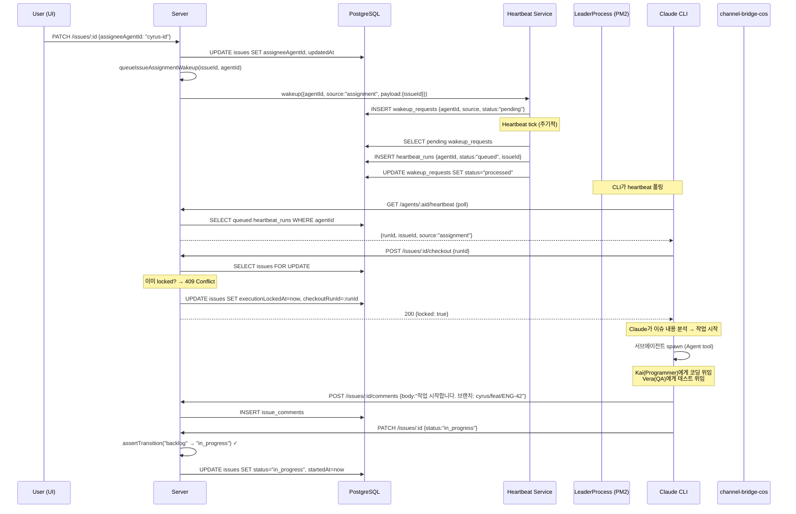
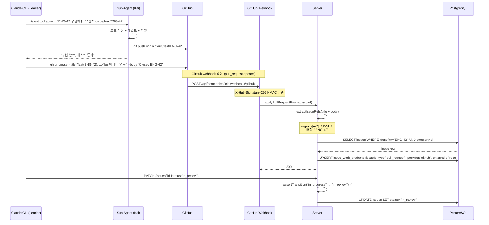
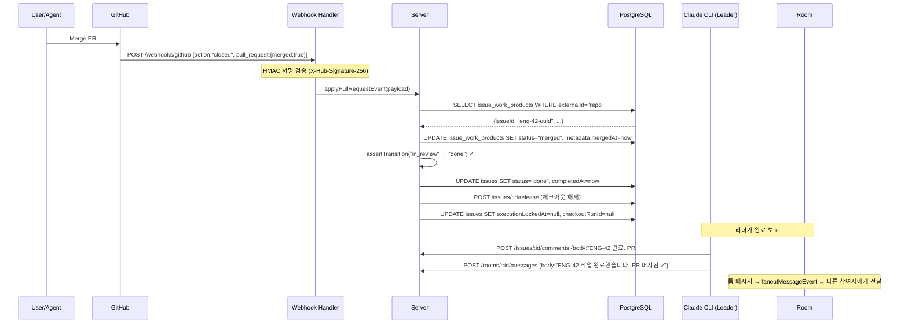
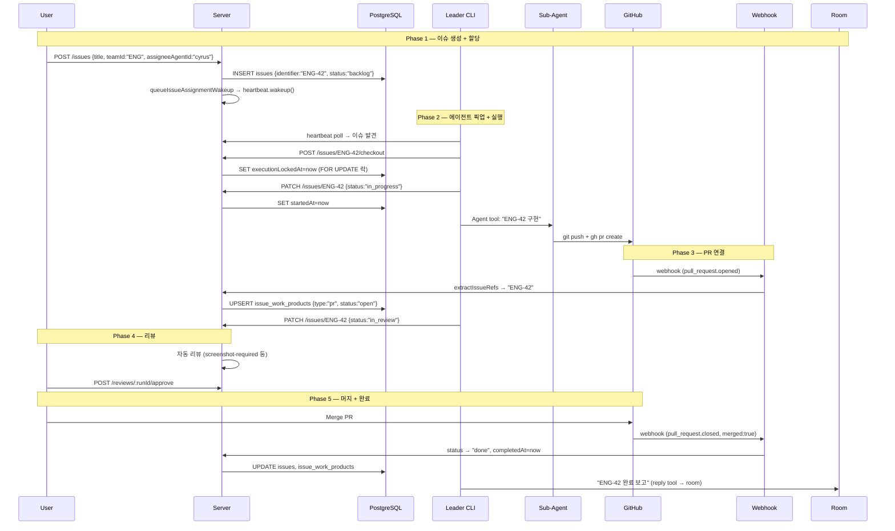

# Issues (이슈)

## 목적
> 에이전트에게 할당되는 작업 단위. 생성 → 할당 → 체크아웃 → 실행 → PR → 리뷰 → 머지 → 완료 라이프사이클을 관리하며, 팀별 워크플로우와 목표에 연결된다.

## 목표
- 팀별 커스텀 워크플로우 상태 지원 (팀 식별자 기반 이슈 번호 생성)
- 에이전트 체크아웃/릴리스 기반 실행 잠금
- 목표 자동 할당 (Goal Fallback)
- 차단/차단됨 관계로 의존성 추적
- GitHub PR 자동 연결 + 리뷰 파이프라인
- 코멘트, 문서, 작업 산출물, 승인 연결

## Sequence Diagrams

### 1. 이슈 생성 (식별자 + 목표 자동 결정)

```mermaid
sequenceDiagram
    participant U as User/Agent
    participant S as Server
    participant DB as PostgreSQL

    U->>S: POST /companies/:cid/issues {title, teamId, projectId, priority}

    rect rgb(40, 40, 60)
    Note over S,DB: Transaction
    S->>DB: SELECT teams SET issueCounter = issueCounter + 1 RETURNING (FOR UPDATE, 원자적)
    DB-->>S: teamIdentifier="ENG", issueNumber=42

    S->>S: identifier = "ENG-42"

    S->>S: resolveIssueGoalId(goalId, projectId, companyId)
    Note over S: 1. 명시적 goalId → 사용<br/>2. project.goalId → 사용<br/>3. company default goal → 사용<br/>4. null

    S->>DB: INSERT issues {id, companyId, teamId, title, identifier:"ENG-42", status:"backlog", priority, goalId}
    DB-->>S: issue row
    end

    S-->>U: 201 {id, identifier:"ENG-42", status:"backlog", ...}
```



### 2. 이슈 할당 → 에이전트 웨이크업 (전체 플로우)



### 3. 작업 완료 → PR 생성 → GitHub 연동



### 4. 리뷰 파이프라인 + 승인 게이트

```mermaid
sequenceDiagram
    participant U as User/Reviewer
    participant S as Server
    participant DB as PostgreSQL
    participant RE as ReviewExecutor
    participant GH as GitHub

    Note over S,DB: PR이 open 상태 → 리뷰 파이프라인 시작

    S->>DB: SELECT review_pipeline_templates WHERE teamId
    DB-->>S: [{slug:"screenshot-required", type:"auto"}, {slug:"code-review", type:"manual"}]

    rect rgb(50, 40, 40)
    Note over RE: 자동 리뷰 스텝 실행

    RE->>RE: screenshot-required 체크
    Note over RE: PR이 UI 파일 수정?<br/>(.tsx, ui/*, .css/.scss)
    alt UI 파일 수정 + 스크린샷 없음
        RE->>DB: UPDATE review_step SET status="failed", reason:"UI 변경에 스크린샷 필수"
    else 스크린샷 있거나 UI 파일 아님
        RE->>DB: UPDATE review_step SET status="passed"
    end
    end

    U->>S: GET /issues/:id (리뷰 상태 확인)
    S-->>U: {status:"in_review", workProducts:[{type:"pr", reviewState:"pending"}], reviewSteps:[...]}

    Note over U: 수동 코드 리뷰

    U->>S: POST /issues/:issueId/reviews/:runId/approve
    S->>DB: UPDATE review_run SET status="approved"

    alt 모든 리뷰 스텝 통과
        Note over U: "Merge" 버튼 활성화
    else 일부 실패
        Note over U: "Merge" 버튼 비활성 + 실패 사유 표시
    end
```



### 5. PR 머지 → 이슈 자동 완료



### 6. 전체 이슈 라이프사이클 (종합)



## 데이터 모델

```
issues
├── id, companyId (FK → companies)
├── teamId (FK → teams), projectId (FK → projects), goalId (FK → goals)
├── parentId (FK → issues, 자기참조 — 서브이슈)
├── title, description
├── status (text — 팀 워크플로우 slug: backlog|todo|in_progress|in_review|blocked|done|cancelled)
├── priority (critical | high | medium | low)
├── identifier (text, unique — e.g. ENG-42), issueNumber
├── assigneeAgentId (FK → agents), assigneeUserId
├── checkoutRunId, executionRunId (FK → heartbeatRuns)
├── executionLockedAt, executionState (jsonb)
├── originKind (manual | routine_execution | ...), originId
├── billingCode, estimate
├── startedAt, completedAt, cancelledAt, hiddenAt
└── createdAt, updatedAt

issue_work_products — PR/브랜치/스크린샷/문서 연결
├── id, issueId (FK), companyId
├── type (pull_request | document | screenshot)
├── provider ("github"), externalId ("repo#123")
├── title, url, status (open | draft | merged | closed)
├── reviewState (none | approved | changes_requested)
├── isPrimary, metadata (jsonb)
└── createdAt, updatedAt

issue_relations — 차단/의존성
├── sourceIssueId, targetIssueId
├── type (blocks | blocked_by)

issue_comments — 코멘트
issue_documents — 문서 첨부
issue_approvals — 승인 N:N 연결
```

## API

| Method | Endpoint | 설명 |
|--------|----------|------|
| GET | `/companies/:companyId/issues` | 이슈 목록 (필터 지원) |
| POST | `/companies/:companyId/issues` | 이슈 생성 |
| GET/PATCH/DELETE | `/issues/:id` | 조회/수정/삭제 |
| POST | `/issues/:id/checkout` | 에이전트 실행 잠금 (FOR UPDATE) |
| POST | `/issues/:id/release` | 실행 잠금 해제 |
| GET/POST | `/issues/:id/comments` | 코멘트 목록/추가 |
| GET/POST/DELETE | `/issues/:id/approvals` | 승인 연결 관리 |
| GET/PUT/DELETE | `/issues/:id/documents/:key` | 문서 관리 |
| POST | `/issues/:id/work-products` | 작업 산출물 생성 |
| POST/DELETE | `/issues/:id/read` | 읽음 표시 |
| POST/DELETE | `/issues/:id/inbox-archive` | 인박스 보관 |
| POST | `/webhooks/github` | GitHub PR webhook (HMAC 검증) |
| POST | `/issues/:id/reviews/:runId/approve` | 리뷰 승인 |
| POST | `/issues/:id/reviews/:runId/reject` | 리뷰 거부 |

## 비즈니스 로직

### 상태 전이 + 사이드 이펙트

| 전이 | 사이드 이펙트 |
|------|--------------|
| `* → in_progress` | `startedAt = now` (최초 1회) |
| `* → done` | `completedAt = now` |
| `* → cancelled` | `cancelledAt = now` |
| `* → *` (동일 상태) | idempotent, 에러 없음 |

- 팀 워크플로우에 정의된 상태만 허용 (`team_workflow_statuses` 검증)
- `assertTransition(from, to)` — 모든 상태 변경 전 호출

### 식별자 생성
- 팀 있을 때: `{team.identifier}-{team.issueCounter++}` (e.g. `ENG-42`)
- 팀 없을 때: `{company.issuePrefix}-{company.issueCounter++}`
- 카운터 증가는 `FOR UPDATE` 트랜잭션으로 원자적

### 체크아웃/릴리스 (실행 잠금)
- `POST /checkout`: `executionLockedAt + checkoutRunId` 설정 (SELECT FOR UPDATE)
- 이미 다른 에이전트가 lock → 409 Conflict
- Staleness 감지: `executionRunId`의 heartbeat run이 `queued|running`이 아니면 dead lock으로 판단, 자동 해제
- `POST /release`: lock 해제

### Goal Fallback (`resolveIssueGoalId`)
1. 명시적 `goalId` → 그대로 사용
2. `project.goalId` → 프로젝트 목표 상속
3. company default goal → 회사 기본 목표
4. `null`

### GitHub PR 연동
- `X-Hub-Signature-256` HMAC 검증 (SHA-256)
- Secret: `company_secrets.name='github_webhook'` 또는 `GITHUB_WEBHOOK_SECRET` env
- PR title + body에서 이슈 식별자 추출: `/[A-Z]+\d*-\d+/g`
- `issue_work_products` upsert (provider="github", externalId="repo#pr_number")
- PR merged → 이슈 status를 "done"으로 자동 전이

### 리뷰 파이프라인
- 팀별 `review_pipeline_templates`로 리뷰 스텝 정의
- 자동 스텝: `screenshot-required` — UI 파일 수정 시 스크린샷 첨부 필수
- 수동 스텝: 사람이 approve/reject
- 모든 스텝 통과해야 머지 가능

### 에이전트 웨이크업
- 이슈 할당 → `queueIssueAssignmentWakeup()` → `heartbeat.wakeup()`
- Heartbeat service가 `wakeup_requests` → `heartbeat_runs` 생성
- CLI가 polling으로 queued run 감지 → checkout → 실행

## UI
- **IssuesList**: 테이블 + 칸반 뷰, 필터(상태/우선순위/담당자/프로젝트/팀/라벨), 그룹핑, 정렬
- **IssueDetail**: 탭 — Activity, Documents, Work Products, Timeline + 인라인 편집
- **IssueReviewSection**: PR 리뷰 상태, 스크린샷 확인, approve/reject 버튼
- **NewIssueDialog**: 이슈 생성 폼

## 관련 엔티티
- **Agent**: 담당자(`assigneeAgentId`), 체크아웃 실행자
- **Team**: `teamId` — 팀 스코프 워크플로우/식별자/리뷰 파이프라인
- **Project**: `projectId` — 프로젝트 소속
- **Goal**: `goalId` — 목표 연결 (fallback 포함)
- **HeartbeatRun**: 에이전트 실행 추적 (`checkoutRunId`, `executionRunId`)
- **Approval**: `issue_approvals` N:N 연결
- **Room**: `room_issues`로 채팅방에 연결
- **WorkProduct**: `issue_work_products`로 PR/스크린샷 연결

## 파일 경로
| 구분 | 경로 |
|------|------|
| Schema | `packages/db/src/schema/issues.ts` |
| Service | `server/src/services/issues.ts` |
| Goal Fallback | `server/src/services/issue-goal-fallback.ts` |
| Assignment Wakeup | `server/src/services/issue-assignment-wakeup.ts` |
| Heartbeat | `server/src/services/heartbeat.ts` |
| GitHub Webhook | `server/src/services/github-webhooks.ts`, `server/src/routes/github-webhooks.ts` |
| Review Pipeline | `server/src/services/review-executors.ts` |
| Work Products | `server/src/services/work-products.ts` |
| Route | `server/src/routes/issues.ts` |
| Page | `ui/src/pages/IssueDetail.tsx` |
| Component | `ui/src/components/IssuesList.tsx`, `IssueRow.tsx`, `NewIssueDialog.tsx` |
