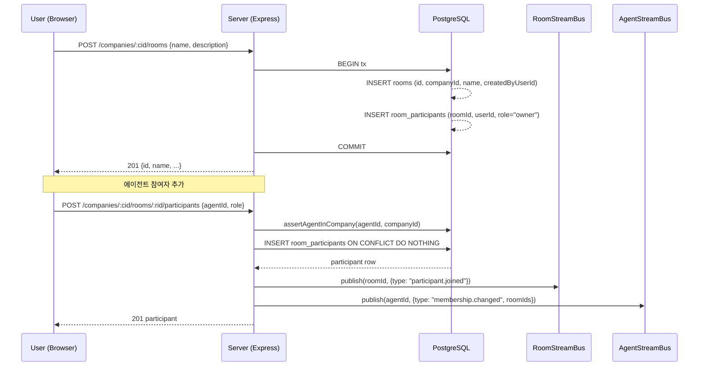
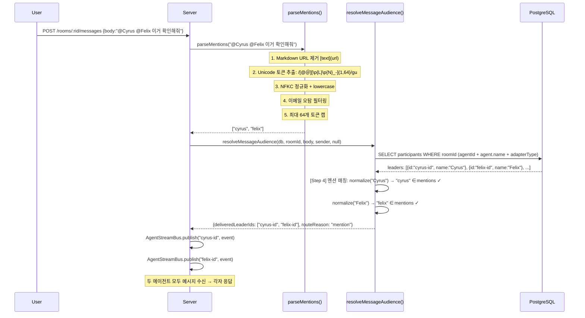

# Rooms (룸)

> ⚠️ **예시 주의 (2026-04-16 이후)**
> 본문 시퀀스 다이어그램의 `@Cyrus`, `@Felix` 등은 pre-refactor 기준 예시.
> 현재 활성 Coordinator 는 **Sophia / Hana / Rex** + 루트 Atlas.
> 실제 운영 시 해당 이름으로 치환. 기능/라우팅 로직은 그대로 유효.

## 목적
> 에이전트와 사용자가 실시간으로 소통하는 채팅방. @멘션 라우팅, 액션 메시지, 승인 게이팅을 지원한다.

## 목표
- 에이전트/사용자 간 텍스트 + 액션 메시지 교환
- @멘션 기반 에이전트 라우팅 (Unicode 지원, 64개 토큰 제한)
- 액션 메시지의 승인 게이팅 (실행 전 승인 필요)
- 이슈 연결로 컨텍스트 공유
- 첨부 파일 및 답글 스레딩

## Sequence Diagrams

### 1. 룸 생성 + 참여자 추가



### 2. 메시지 전송 → 에이전트 응답 (핵심 플로우)

```mermaid
sequenceDiagram
    participant U as User (Browser)
    participant S as Server
    participant DB as PostgreSQL
    participant RSB as RoomStreamBus
    participant AUD as resolveMessageAudience
    participant ASB as AgentStreamBus
    participant SSE as SSE Endpoint
    participant CB as channel-bridge-cos
    participant CLI as Claude CLI

    U->>S: POST /rooms/:rid/messages {type:"text", body:"진행상황 어떄요?"}

    rect rgb(40, 40, 60)
    Note over S,DB: Transaction
    S->>DB: Verify room exists & belongs to company
    S->>DB: Validate senderUserId in company
    S->>DB: INSERT room_messages RETURNING row
    S->>DB: UPDATE rooms SET updatedAt=now()
    end

    Note over S,ASB: fanoutMessageEvent()

    S->>RSB: publish(roomId, {type:"message.created", message})
    Note over RSB: UI polling이 이 데이터를 가져감

    S->>AUD: resolveMessageAudience(db, roomId, body, sender, target)

    rect rgb(50, 40, 40)
    Note over AUD: 라우팅 우선순위 체인
    AUD->>AUD: [1] actionTarget → 지정된 에이전트만
    AUD->>AUD: [2] emptyBody → 아무도 안 보냄
    AUD->>AUD: [3] @all/@everyone → 전체 리더
    AUD->>AUD: [4] @멘션 파싱 → 언급된 리더
    AUD->>AUD: [5] replyTo → 원본 작성자
    AUD->>AUD: [6] topicMatch → 점수 기반 매칭
    AUD->>AUD: [7] coordinator → 룸 코디네이터/이슈 담당자
    AUD->>AUD: [8] firstLeader → 첫 번째 리더 폴백
    end

    AUD-->>S: {deliveredLeaderIds: [cyrus-id], routeReason: "coordinator"}

    loop 각 대상 에이전트
        S->>ASB: publish(agentId, {type:"message.created", roomId, message})
        ASB->>SSE: SSE event push (in-memory)
        SSE->>CB: data: {"type":"message.created","roomId":"...","message":{...}}
    end

    CB->>CB: self-loop filter (senderAgentId !== myId)
    CB->>CB: rememberMessageRoom(messageId, roomId)
    CB->>CLI: notifications/claude/channel {content, meta: {sender, room_id, message_id}}
    CLI->>CLI: Claude가 메시지 분석 + 응답 생성

    CLI->>CB: call tool "reply" {message:"진행상황 보고...", thread_ts:"msg-id"}
    CB->>CB: roomId = messageIdToRoom.get(thread_ts)
    CB->>S: POST /rooms/:rid/messages {type:"text", body, replyToId, senderAgentId}

    Note over S,DB: 에이전트 응답도 동일한 sendMessage 플로우
    S->>DB: INSERT room_messages (senderAgentId=cyrus)
    S->>RSB: publish(roomId, {type:"message.created"})
    S->>AUD: resolveMessageAudience(...)
    Note over AUD: 에이전트가 보낸 메시지 → 다른 에이전트에게 전달될 수 있음

    RSB-->>U: (polling) 새 메시지 감지
    U->>S: GET /rooms/:rid/messages
    S-->>U: [원본 메시지, Cyrus 응답, ...]
```



### 3. 액션 메시지 + 승인 게이팅

```mermaid
sequenceDiagram
    participant U as User
    participant S as Server
    participant DB as PostgreSQL
    participant ASB as AgentStreamBus
    participant CB as channel-bridge-cos
    participant CLI as Claude CLI (Target)

    U->>S: POST /rooms/:rid/messages {type:"action", body:"Deploy prod", actionTargetAgentId:"cyrus", requiresApproval:true}

    rect rgb(40, 40, 60)
    Note over S,DB: Transaction
    S->>DB: INSERT approvals {type:"action_execution", status:"pending", payload:{...}}
    DB-->>S: approvalId
    S->>DB: INSERT room_messages {type:"action", actionStatus:"pending", approvalId, actionTargetAgentId}
    end

    S->>ASB: publish(cyrus-id, {type:"message.created"})
    Note over ASB: actionTarget 라우팅 → Cyrus만 수신

    ASB->>CB: SSE event
    CB->>CLI: notification (action message)
    CLI->>CLI: 액션 인지, 승인 대기

    Note over U: UI에서 "⏸ 승인 대기" 배지 표시
    Note over U: "Mark executed" 버튼 비활성

    U->>S: POST /approvals/:id/decide {decision:"approved"}
    S->>DB: UPDATE approvals SET status="approved"
    S-->>U: 200

    Note over U: "Mark executed" 버튼 활성화

    CLI->>CB: call tool "reply" {message:"배포 완료"}
    CB->>S: PATCH /rooms/:rid/messages/:mid/action-status {nextStatus:"executed", result:{...}}

    rect rgb(40, 40, 60)
    Note over S,DB: SELECT ... FOR UPDATE (락)
    S->>DB: Validate: pending → executed ✓
    S->>DB: UPDATE room_messages SET actionStatus="executed", actionResult, actionExecutedAt
    end

    S->>ASB: publish (message.updated → 전체 참여자)
    S-->>U: (polling) 상태 변경 감지 → "✓ 실행됨" 표시
```



### 4. @멘션 라우팅 상세



### 5. SSE 연결 + 커서 기반 재개

```mermaid
sequenceDiagram
    participant CB as channel-bridge-cos
    participant SSE as SSE Endpoint (/agents/:aid/stream)
    participant ASB as AgentStreamBus
    participant DB as PostgreSQL

    CB->>SSE: GET /agents/:aid/stream?since=last-msg-id
    Note over SSE: Auth: Bearer agent_api_key
    SSE-->>CB: Headers: Content-Type: text/event-stream

    rect rgb(40, 50, 40)
    Note over SSE,DB: DB Replay (missed messages)
    SSE->>DB: SELECT room_messages WHERE createdAt > since AND agent is participant
    DB-->>SSE: [missed msg1, missed msg2, ...]
    SSE-->>CB: data: {type:"message.created", message: msg1}
    SSE-->>CB: data: {type:"message.created", message: msg2}
    end

    Note over SSE,ASB: Live streaming

    SSE->>ASB: subscribe(agentId, listener)

    loop 실시간 이벤트
        ASB->>SSE: event (from fanoutMessageEvent)
        SSE-->>CB: data: {type:"message.created", ...}
        CB->>CB: writeState({lastMessageId: msg.id})
    end

    loop 15초 간격
        SSE-->>CB: :keepalive
    end

    Note over CB: 연결 끊김 시 → exponential backoff 재연결
    Note over CB: 재연결 시 urlFactory()가 최신 cursor 포함
```



## 데이터 모델

```
rooms
├── id, companyId (FK → companies)
├── name, description
├── status (active | archived)
├── coordinatorAgentId (FK → agents, nullable)
├── createdByUserId, createdByAgentId
└── createdAt, updatedAt

room_participants
├── id, roomId (FK), companyId
├── agentId (FK), userId
├── role (member | owner)
└── joinedAt, createdAt, updatedAt

room_messages
├── id, roomId (FK), companyId
├── senderAgentId (FK), senderUserId
├── type (text | action)
├── body (text)
├── actionPayload (jsonb), actionStatus (pending | executed | failed)
├── actionTargetAgentId (FK), actionResult (jsonb), actionError
├── actionExecutedAt, actionExecutedByAgentId
├── approvalId (FK → approvals, RESTRICT — 승인 게이팅)
├── attachments (jsonb array)
├── replyToId (FK → room_messages, 자기참조 — 답글)
└── createdAt

room_issues — rooms ↔ issues N:M 연결
```

## API

| Method | Endpoint | 설명 |
|--------|----------|------|
| GET | `/:companyId/rooms` | 룸 목록 (참여 중인 룸만) |
| POST | `/:companyId/rooms` | 룸 생성 (생성자 = owner) |
| GET/PATCH/DELETE | `/:companyId/rooms/:roomId` | 조회/수정/아카이브 |
| GET/POST/DELETE | `/:companyId/rooms/:roomId/participants` | 참여자 관리 |
| GET | `/:companyId/rooms/:roomId/messages` | 메시지 이력 (cursor pagination) |
| POST | `/:companyId/rooms/:roomId/messages` | 메시지 전송 |
| PATCH | `/:companyId/rooms/:roomId/messages/:id/action-status` | 액션 상태 업데이트 (pending→executed/failed) |
| POST | `/:companyId/rooms/:roomId/attachments` | 첨부 업로드 |
| GET/POST/DELETE | `/:companyId/rooms/:roomId/issues` | 이슈 연결 관리 |

## 비즈니스 로직

### 메시지 라우팅 우선순위 (resolveMessageAudience)

| 우선순위 | 조건 | 전달 대상 | routeReason |
|----------|------|-----------|-------------|
| 1 | actionTargetAgentId 지정 | 해당 에이전트만 | `action_target` |
| 2 | body가 빈 문자열 | 아무에게도 안 보냄 | `empty_body` |
| 3 | @all / @everyone / @전체 / @모두 | 전체 리더 | `all` |
| 4 | @멘션 매칭 | 멘션된 리더들 | `mention` |
| 5 | replyToId 있음 | 원본 메시지 작성자 | `reply_to` |
| 6 | topicMatch 점수 ≥ 2 | 최고 점수 리더 | `topic_match` |
| 7 | coordinator 존재 | 코디네이터 에이전트 | `coordinator` |
| 8 | 리더 1명 이상 존재 | 첫 번째 리더 | `first_leader` |
| 9 | 리더 없음 | 전달 안 함 | `no_leaders` |

### 코디네이터 결정 순서
1. `room.coordinatorAgentId` (명시 설정)
2. 연결된 이슈(`room_issues`)의 담당 에이전트
3. `room.createdByAgentId` (폴백)

### 멘션 파싱 규칙
- Unicode 토큰: `[\p{L}\p{N}_\-]{1,64}` (한국어, 라틴, 키릴 등 전부 지원)
- NFKC 정규화 + lowercase
- Markdown URL `[text](url)` 내부 제외
- 이메일 주소 오탐 방지
- body 최대 16KB 스캔, 토큰 최대 64개

### 승인 게이팅 (Action + Approval)
- `requiresApproval: true` → `approvals` 행 자동 생성
- `approvalId` FK(RESTRICT) — 승인 삭제 시 메시지 보호
- 승인 전: `Mark executed` 버튼 비활성
- 상태 전이: `pending → executed|failed` (FOR UPDATE 락, idempotent)

### 자기 루프 방지
- AgentStreamBus: senderAgentId === 자신 → 이벤트 전달하지만
- channel-bridge-cos: `onInbound()`에서 `senderAgentId === env.COS_AGENT_ID` → skip

## 아키텍처 구성요소

### 버스 구조
| 버스 | 키 | 용도 | 구독자 |
|------|------|------|--------|
| RoomStreamBus | roomId | 룸 내 모든 이벤트 | UI (polling 간접) |
| AgentStreamBus | agentId | 에이전트별 필터된 이벤트 | SSE → channel-bridge-cos |
| StreamBus | topic + key | 제네릭 pub-sub 기반 | 위 두 버스의 인프라 |

### 실시간 전달 경로
```
Server (fanout) → AgentStreamBus → SSE endpoint → channel-bridge-cos → Claude CLI
                                                                        ↓
                                                                   reply tool
                                                                        ↓
                                                              POST /rooms/:rid/messages
                                                                        ↓
                                                                   (같은 fanout 반복)
```

### UI 업데이트
- WebSocket 없음 (Phase 3c 연기)
- React Query polling (~300ms)으로 메시지 갱신

## 관련 엔티티
- **Agent**: 참여자(`room_participants`), 메시지 발신자, 액션 대상, 코디네이터
- **Issue**: `room_issues`로 연결, 코디네이터 결정에 사용
- **Approval**: 액션 메시지의 승인 게이팅 (`approvals.id` ← `room_messages.approvalId`)
- **LeaderProcess**: 리더 CLI가 PM2로 관리되며 channel-bridge-cos MCP 서버 포함

## 파일 경로
| 구분 | 경로 |
|------|------|
| Schema | `packages/db/src/schema/rooms.ts`, `room_messages.ts`, `room_participants.ts` |
| Service | `server/src/services/rooms.ts` |
| Route | `server/src/routes/rooms.ts` |
| Audience | `server/src/services/rooms.ts` → `resolveMessageAudience()`, `parseMentions()` |
| RoomStreamBus | `server/src/services/room-stream-bus.ts` |
| AgentStreamBus | `server/src/services/agent-stream-bus.ts` |
| SSE Endpoint | `server/src/routes/agent-streams.ts` |
| Channel Bridge | `packages/channel-bridge-cos/src/index.ts` |
| SSE Client | `packages/channel-bridge-cos/src/sse-client.ts` |
| Page | `ui/src/pages/rooms.tsx` |
